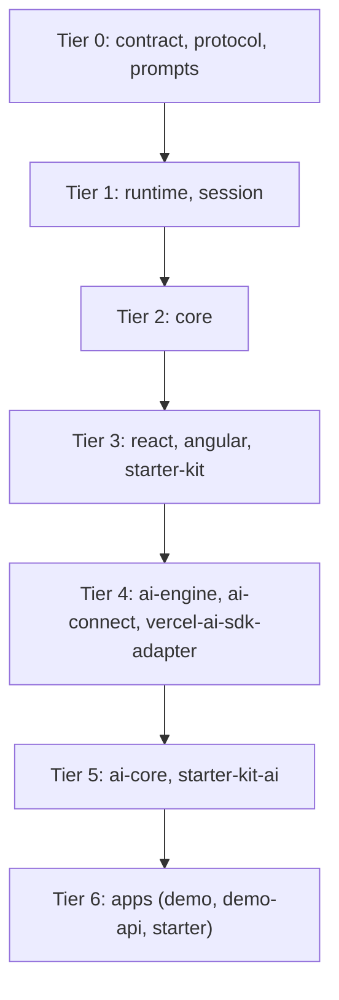

# AI and contributor onboarding

This file is a **navigation map** for learning the CooperContinuum monorepo as a codebase. It does not replace product philosophy, SDK reference, or integration guides elsewhere.

## How this relates to other docs

- **[README.md](README.md)** — What Continuum is for end users and integrators, consumer-oriented reading paths, quick start samples, and the high-level architecture block.
- **[AGENTS.md](AGENTS.md)** — Default agent context: product goals, package lanes, where behavior should live, architectural boundaries, and **source-of-truth order** when docs disagree with code.
- **[CONTINUUM.md](CONTINUUM.md)** — SDK-shaped reference (types, integration patterns) for implementing against published APIs.
- **This file** — Full tree map, **every package and app**, how to explore them systematically, anchor files, `.cursor/` layout, and paths that are usually noise.

**Source of truth:** When prose and implementation disagree, follow the order in [AGENTS.md](AGENTS.md) (manifests, exports, ESLint boundaries, rules, then human docs).

## Full repository map (top level)

```text
apps/
  demo/              Nx: demo — scope:demo — brand site, playground, Vercel AI SDK demos
  demo-api/          Nx: demo-api — scope:demo-api — Cloudflare worker transport playground
  starter/           Nx: starter — scope:starter-app — slim integration harness / template

packages/
  contract/          scope:contract — view and data contracts
  protocol/          scope:protocol — operational and wire-oriented shared types
  prompts/           scope:prompts — prompt templates for AI view generation
  runtime/           scope:runtime — stateless reconciliation engine
  session/           scope:session — session lifecycle, persistence, streaming coordination
  core/              scope:core — facade: contract + runtime + session
  react/             scope:react — headless React bindings
  angular/           scope:angular — Angular bindings (internal, not in public release group)
  starter-kit/       scope:starter-kit — preset React layer, primitives, component map, styles
  starter-kit-ai/    scope:starter-kit-ai — optional AI UI wrappers over starter-kit
  ai-engine/         scope:ai-engine — headless AI planning, authoring, guardrails, execution
  ai-connect/        scope:ai-connect — provider and model catalog helpers
  ai-core/           scope:ai-core — facade: re-exports core stack + AI + React + transport
  vercel-ai-sdk-adapter/  scope:vercel-ai-sdk-adapter — Vercel AI SDK stream bridge
  adapters/          scope:adapters — internal protocol adapters (not in public release group)

docs/                Whitelisted guides (see root .gitignore — most of docs/ is ignored except listed files)
.cursor/
  rules/             Workspace rules (.mdc): architecture, clean code, public API docs
  agents/            Specialized review persona prompts (markdown)
  skills/            Repeatable workflows (SKILL.md)

scripts/             Release and workspace tooling (build, verify, sync entrypoints)
.github/workflows/   CI (e.g. ci.yml)
.verdaccio/          Local registry config for Nx release tooling
eslint.config.mjs    @nx/enforce-module-boundaries → depConstraints (allowed import edges)
nx.json              Nx plugins, target defaults, public release group membership
package.json         Root workspaces, npm scripts (release pipeline entrypoints)
RELEASE.md, CHANGELOG.md   Release and versioning process
CONTINUUM.md         SDK-oriented reference (root)
```

## Package catalog (explore every library)

Use this table when you need to **land in the right folder** and **know what to open first**. The **first open** column is the usual public barrel; always confirm **`package.json` → `exports`** for subpath entrypoints (for example `@continuum-dev/runtime/validator`).

| Folder | npm name | Nx `scope:*` | In `nx.json` public release group | Role (from package description) | First open |
| --- | --- | --- | --- | --- | --- |
| `packages/contract` | `@continuum-dev/contract` | `scope:contract` | yes | Declarative view and data model contracts | [packages/contract/src/index.ts](packages/contract/src/index.ts) |
| `packages/protocol` | `@continuum-dev/protocol` | `scope:protocol` | yes | Shared operational protocols for runtime, session, streaming | [packages/protocol/src/index.ts](packages/protocol/src/index.ts) |
| `packages/prompts` | `@continuum-dev/prompts` | `scope:prompts` | yes | Prompt templates and helpers for AI view generation | [packages/prompts/src/index.ts](packages/prompts/src/index.ts) |
| `packages/runtime` | `@continuum-dev/runtime` | `scope:runtime` | yes | Reconciliation engine for view continuity | [packages/runtime/src/index.ts](packages/runtime/src/index.ts) |
| `packages/session` | `@continuum-dev/session` | `scope:session` | yes | Session lifecycle, persistence, checkpoints, streaming coordination | [packages/session/src/index.ts](packages/session/src/index.ts) |
| `packages/core` | `@continuum-dev/core` | `scope:core` | yes | Convenience facade over contract, runtime, session | [packages/core/src/index.ts](packages/core/src/index.ts) |
| `packages/react` | `@continuum-dev/react` | `scope:react` | yes | Headless React bindings for the continuity runtime | [packages/react/src/index.ts](packages/react/src/index.ts) |
| `packages/angular` | `@continuum-dev/angular` | `scope:angular` | **no** (internal) | Angular bindings for the continuity runtime | [packages/angular/src/index.ts](packages/angular/src/index.ts) |
| `packages/starter-kit` | `@continuum-dev/starter-kit` | `scope:starter-kit` | yes | React starter: primitives, component map, styles, session tooling | [packages/starter-kit/src/index.ts](packages/starter-kit/src/index.ts) |
| `packages/starter-kit-ai` | `@continuum-dev/starter-kit-ai` | `scope:starter-kit-ai` | yes | Optional AI UI wrappers for starter-kit integrations | [packages/starter-kit-ai/src/index.ts](packages/starter-kit-ai/src/index.ts) |
| `packages/ai-engine` | `@continuum-dev/ai-engine` | `scope:ai-engine` | yes | Headless AI planning, authoring, normalization, apply helpers | [packages/ai-engine/src/index.ts](packages/ai-engine/src/index.ts) |
| `packages/ai-connect` | `@continuum-dev/ai-connect` | `scope:ai-connect` | yes | Headless provider connection clients for AI workflows | [packages/ai-connect/src/index.ts](packages/ai-connect/src/index.ts) |
| `packages/ai-core` | `@continuum-dev/ai-core` | `scope:ai-core` | yes | Facade: React, session, engine, and transport primitives (mostly re-exports) | [packages/ai-core/src/index.ts](packages/ai-core/src/index.ts) |
| `packages/vercel-ai-sdk-adapter` | `@continuum-dev/vercel-ai-sdk-adapter` | `scope:vercel-ai-sdk-adapter` | yes | Adapter for the Vercel AI SDK stream protocol | [packages/vercel-ai-sdk-adapter/src/index.ts](packages/vercel-ai-sdk-adapter/src/index.ts) |
| `packages/adapters` | `@continuum-dev/adapters` | `scope:adapters` | **no** (internal) | Protocol adapters for the continuity runtime | [packages/adapters/src/index.ts](packages/adapters/src/index.ts) |

**Facades versus policy:** `core`, `ai-core`, `starter-kit`, and `starter-kit-ai` skew toward **composition and ergonomics**. Durable rules usually belong in `contract`, `protocol`, `runtime`, or `session` (see [AGENTS.md](AGENTS.md)).

## Applications

| Path | Nx project name | `scope:*` | Purpose |
| --- | --- | --- | --- |
| [apps/demo](apps/demo) | `demo` | `scope:demo` | Full composition root: routing, marketing pages, AI demos, starter-kit usage |
| [apps/demo-api](apps/demo-api) | `demo-api` | `scope:demo-api` | Worker-style API for streams and providers (Wrangler); pairs with transport experiments |
| [apps/starter](apps/starter) | `starter` | `scope:starter-app` | Minimal app for validating starter-kit + Vercel adapter wiring (not the npm consumer contract) |

**Repo apps versus published consumers:** Treat `apps/*` as integration surfaces. The canonical downstream experience is the **packed** output under `dist/packages/*` after the release scripts (see [AGENTS.md](AGENTS.md) and [.cursor/rules/repo-apps-vs-library-consumers.mdc](.cursor/rules/repo-apps-vs-library-consumers.mdc)).

## Root tooling and release pipeline

| Path | Role |
| --- | --- |
| [scripts/build-release-packages.mjs](scripts/build-release-packages.mjs) | Builds publishable artifacts |
| [scripts/prepare-dist-packages.mjs](scripts/prepare-dist-packages.mjs) | Prepares dist layout for packing |
| [scripts/verify-release-packages.mjs](scripts/verify-release-packages.mjs) | Consumer-style checks on packed output |
| [scripts/sync-workspace-entrypoints.mjs](scripts/sync-workspace-entrypoints.mjs) | Generates package-root `*.js` / `*.mjs` re-exports into `dist` (do not hand-edit those stubs) |
| [scripts/release-public-packages.mjs](scripts/release-public-packages.mjs) | Release helper used with Nx release configuration |
| Root [package.json](package.json) scripts | `build:release-packages`, `verify:release-packages`, `publish:public-packages`, etc. |

## Dependency layers (conceptual, for exploration order)

When learning or changing behavior, it helps to move **from stable inner packages outward**. **Allowed import edges** are only what [eslint.config.mjs](eslint.config.mjs) permits; the stack below is a **reading order** and stability heuristic, not a full import graph.



**Internal / cross-cutting:** `adapters` is not in the public release group; explore it when a task mentions protocol bridges or A2UI-style integration, starting from [packages/adapters/src/index.ts](packages/adapters/src/index.ts).

## How agents should explore a package (repeatable checklist)

Use this on **any** row in the package catalog so you do not guess from folder names alone.

1. **Identity** — Open `packages/<name>/package.json`: `name`, `description`, `nx.tags`, `dependencies` / `peerDependencies`, and especially **`exports`** (subpaths matter for `runtime`, `vercel-ai-sdk-adapter`, and others).
2. **Public barrel** — Open the main TypeScript entry referenced by `exports["."].import` or the `@continuum-dev/source` condition (usually `src/index.ts`). That file lists the **intended** surface; follow re-exports into `src/lib/**`.
3. **Layout** — List `packages/<name>/src/lib/` (or `src/` for shallow packages). Subfolders usually map to **subdomains** (for example `reconcile`, `view-authoring`, `hooks`).
4. **Tests** — Search `packages/<name>/**/*.spec.ts` (or `*.test.ts`) next to or under `src/`. Specs often document stable seams.
5. **Consumers** — From the repo root, search for the npm name (for example `@continuum-dev/session`) to see **who imports it**; start with `packages/` before `apps/`.
6. **Boundaries** — Before adding an import, check [eslint.config.mjs](eslint.config.mjs) `depConstraints` for the source package’s `scope:*` tag (see [clean-architecture-layer-mapping.mdc](.cursor/rules/clean-architecture-layer-mapping.mdc)).
7. **Nx** — Run `npx nx show project <nxProjectName>` when you need targets and root confirmation; project names sometimes differ slightly from folder names.

## Exploration paths by goal

Pick a track and follow it depth-first before jumping across unrelated packages.

| Goal | Start | Then |
| --- | --- | --- |
| **View and snapshot model** | [packages/contract/src/index.ts](packages/contract/src/index.ts) | [docs/VIEW_CONTRACT.md](docs/VIEW_CONTRACT.md), then call sites in `runtime` and `session` |
| **Wire shapes and session ops** | [packages/protocol/src/index.ts](packages/protocol/src/index.ts) | Usages in `session`, `vercel-ai-sdk-adapter`, `runtime` boundaries |
| **Reconciliation** | [packages/runtime/src/index.ts](packages/runtime/src/index.ts) | [packages/runtime/src/lib/reconcile/reconcile-core.ts](packages/runtime/src/lib/reconcile/reconcile-core.ts), specs under `packages/runtime/src/lib/reconcile/` |
| **Session lifecycle** | [packages/session/src/index.ts](packages/session/src/index.ts) | [packages/session/src/lib/session.ts](packages/session/src/lib/session.ts), [packages/session/src/lib/session/README.md](packages/session/src/lib/session/README.md) |
| **React integration** | [packages/react/src/index.ts](packages/react/src/index.ts) | `lib/hooks`, `lib/context`, `lib/renderer` |
| **Preset UI and DX** | [packages/starter-kit/src/index.ts](packages/starter-kit/src/index.ts) | `lib/primitives`, `lib/component-map.js`, `lib/style-config` |
| **AI authoring and execution** | [packages/ai-engine/src/index.ts](packages/ai-engine/src/index.ts) | `lib/view-authoring`, `lib/execution`, `lib/continuum-execution`, `lib/view-patching` |
| **Providers and models** | [packages/ai-connect/src/index.ts](packages/ai-connect/src/index.ts) | `lib/clients`, `lib/registry`, `lib/model-catalog` |
| **Vercel AI SDK bridge** | [packages/vercel-ai-sdk-adapter/src/index.ts](packages/vercel-ai-sdk-adapter/src/index.ts) | `lib/message-application`, `lib/session-adapter`, `lib/data-parts` |
| **Thin AI + React bundle** | [packages/ai-core/src/index.ts](packages/ai-core/src/index.ts) | Follow re-exports back to the packages above (policy rarely lives here) |
| **Starter AI widgets** | [packages/starter-kit-ai/src/index.ts](packages/starter-kit-ai/src/index.ts) | Chat box and controller hooks; compare with `demo` usage |
| **Angular** | [packages/angular/src/index.ts](packages/angular/src/index.ts) | `lib/renderer`, `lib/forms` |
| **Internal protocols** | [packages/adapters/src/index.ts](packages/adapters/src/index.ts) | `lib/a2ui`, `lib/adapter` |
| **End-to-end app wiring** | [apps/demo/src/main.tsx](apps/demo/src/main.tsx) | [apps/demo/src/App.tsx](apps/demo/src/App.tsx); compare with [apps/starter/src/main.tsx](apps/starter/src/main.tsx) |

## Reading order: learn the codebase (maintainers)

Use this when the goal is **how the repo is built**, not “ship my first integration” (for that, use [README.md](README.md) “Recommended reading path”).

1. **[AGENTS.md](AGENTS.md)** — Package system, placement rules, boundaries, source-of-truth order.
2. **[eslint.config.mjs](eslint.config.mjs)** — `depConstraints`: which `scope:*` tags may depend on which; this is the enforced graph.
3. **[.cursor/rules/clean-architecture-layer-mapping.mdc](.cursor/rules/clean-architecture-layer-mapping.mdc)** — Ring and tag names aligned with ESLint (conceptual map).
4. **[packages/contract/src/index.ts](packages/contract/src/index.ts)** — Public exports for the durable model (`ViewDefinition`, snapshots, etc.).
5. **[docs/VIEW_CONTRACT.md](docs/VIEW_CONTRACT.md)** — View and node shapes at the contract level (verify against code if anything looks stale).
6. **[packages/runtime/src/index.ts](packages/runtime/src/index.ts)** → **[packages/runtime/src/lib/reconcile/index.ts](packages/runtime/src/lib/reconcile/index.ts)** — Supported `reconcile` entrypoint and docstring contract.
7. **[packages/runtime/src/lib/reconcile/reconcile-core.ts](packages/runtime/src/lib/reconcile/reconcile-core.ts)** — Core transition orchestration (then follow imports into `reconciliation/*` as needed).
8. **[packages/runtime/src/lib/public-surface.spec.ts](packages/runtime/src/lib/public-surface.spec.ts)** — What the runtime package exposes to consumers.
9. **[packages/runtime/src/lib/reconcile/core.spec.ts](packages/runtime/src/lib/reconcile/core.spec.ts)** — Representative reconciliation behavior tests.
10. **[packages/session/src/index.ts](packages/session/src/index.ts)** → **[packages/session/src/lib/session.ts](packages/session/src/lib/session.ts)** — Session orchestration entry; internal layout is described in [packages/session/src/lib/session/README.md](packages/session/src/lib/session/README.md).
11. **Composition root** — Either [apps/demo/src/main.tsx](apps/demo/src/main.tsx) + [apps/demo/src/App.tsx](apps/demo/src/App.tsx) or [packages/starter-kit/src/index.ts](packages/starter-kit/src/index.ts), depending on whether you prefer a full app or the preset package surface.

**Optional parallel tracks** (after step 3): **AI vertical** — `prompts` → `ai-engine` → `ai-connect` → `vercel-ai-sdk-adapter` → `starter-kit-ai`. **UI vertical** — `react` → `starter-kit` → `angular` (if relevant).

Deep references you can branch to when needed: [packages/runtime/README.md](packages/runtime/README.md), [packages/session/README.md](packages/session/README.md), [CONTINUUM.md](CONTINUUM.md).

## Anchor files

| Path | What you learn |
| --- | --- |
| [eslint.config.mjs](eslint.config.mjs) | Enforced dependency rules between libraries (`depConstraints`). |
| [nx.json](nx.json) | Public release group membership and Nx release hooks. |
| [packages/contract/src/index.ts](packages/contract/src/index.ts) | Contract public surface re-exports. |
| [packages/protocol/src/index.ts](packages/protocol/src/index.ts) | Operational protocol barrels (actions, streams, patches, proposals). |
| [packages/runtime/src/lib/reconcile/reconcile-core.ts](packages/runtime/src/lib/reconcile/reconcile-core.ts) | Heart of view transition reconciliation. |
| [packages/runtime/src/lib/public-surface.spec.ts](packages/runtime/src/lib/public-surface.spec.ts) | Exported API expectations for `@continuum-dev/runtime`. |
| [packages/session/src/lib/session.ts](packages/session/src/lib/session.ts) | Session lifecycle orchestration. |
| [packages/react/src/index.ts](packages/react/src/index.ts) | Headless React public exports. |
| [packages/core/src/index.ts](packages/core/src/index.ts) | Convenience facade wiring contract + runtime + session. |
| [packages/ai-engine/src/index.ts](packages/ai-engine/src/index.ts) | AI engine barrels (execution, authoring, patching, guardrails). |
| [packages/vercel-ai-sdk-adapter/src/index.ts](packages/vercel-ai-sdk-adapter/src/index.ts) | Vercel AI SDK adapter surface and chat bridge exports. |
| [packages/starter-kit/src/index.ts](packages/starter-kit/src/index.ts) | Starter-kit composition over `react` + `core`. |
| [packages/adapters/src/index.ts](packages/adapters/src/index.ts) | Internal adapter entry (for example A2UI-related types and adapters). |

## Walkthrough: change reconciliation behavior in `runtime`

1. **Confirm the edge** — `runtime` must not import outer frameworks or vendors. Check [eslint.config.mjs](eslint.config.mjs) for which packages `runtime` may depend on (tags).
2. **Locate behavior** — Start at [packages/runtime/src/lib/reconcile/reconcile-core.ts](packages/runtime/src/lib/reconcile/reconcile-core.ts) and follow into `reconciliation/*` or `reconcile/*` submodules as needed.
3. **Tests** — Add or extend specs under [packages/runtime/src/lib/reconcile/](packages/runtime/src/lib/reconcile/) (or the specific submodule you touch). Prefer proving behavior through the public `reconcile` API or stable internal seams already covered by tests.
4. **Public API** — If you add or change an **exported** symbol, update [packages/runtime/src/index.ts](packages/runtime/src/index.ts) (and package `exports` in `package.json` if required), add TSDoc per [.cursor/rules/public-api-docs.mdc](.cursor/rules/public-api-docs.mdc), and extend [packages/runtime/src/lib/public-surface.spec.ts](packages/runtime/src/lib/public-surface.spec.ts) if the public surface changes.
5. **Downstream** — Search consumers in `session`, `core`, `react`, and apps; run targeted Nx tests for affected projects.

## `.cursor/` workspace model

- **Rules** — [`.cursor/rules/*.mdc`](.cursor/rules) are editor/workspace constraints. Some are always applied; others apply when relevant. They encode architecture, naming, tests, TypeScript exhaustiveness, and public API documentation policy. They are not executed like a build step; they guide agents and humans in this repo.
- **Agents** — [`.cursor/agents/*.md`](.cursor/agents) are **specialized review prompts** (for example boundary audits, API shape review). They do not auto-run on every change unless your tooling or you explicitly invoke that review. Use them when you want a focused pass on a concern they describe.
- **Skills** — [`.cursor/skills/*/SKILL.md`](.cursor/skills) describe **repeatable workflows** (for example investigation habits or staged commits). They apply when a task matches the skill’s description.

**Summary:** Rules constrain; skills teach procedures; agent markdown files describe optional review personas—not a hidden scheduler.

## Low-signal paths (usually skip for reconnaissance)

- `.nx/cache/` — Nx task outputs and artifacts
- `node_modules/`
- Per-package `dist/` or generated `.js` siblings if present next to sources in your checkout (workspace entrypoint stubs re-export built output; prefer `src/` and release verification for truth)
- Large generated or cached bundles under `.nx/` unless you are debugging the build itself

## Review or research prompt template

Paste and fill in when asking an agent to review or explore without relying on diffs alone:

```text
Goal: (e.g. learn reconciliation, review public API of session)
Non-goals: (e.g. do not compare to main; ignore release scripts)
Scope: (branch name or “current workspace”)
Start here: (2–5 paths from this doc or your feature)
Focus: (e.g. boundaries, naming, tests, docs)
Ignore for now: (e.g. demo-only UI polish, .nx/cache)
Questions: (specific decisions you want answered)
```
