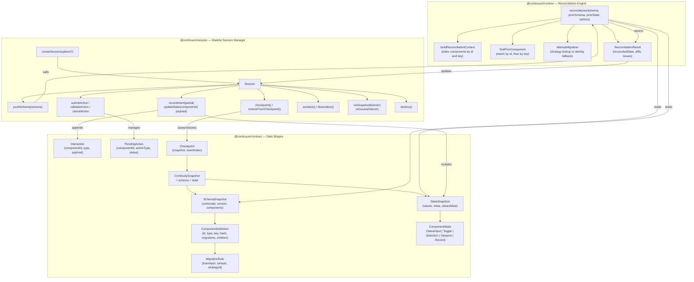
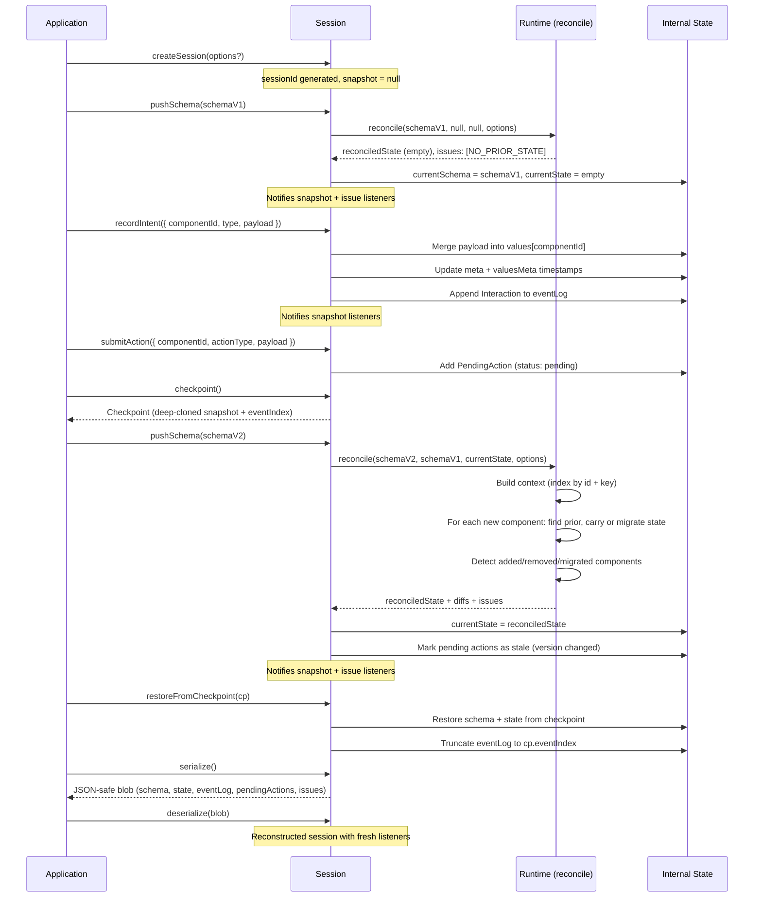

# Continuum Architecture

## Package Dependency & Structure

## Session Lifecycle Flow

## Summary

- **Contract** is the pure type layer -- it defines the shapes for schemas (component trees with migration rules), state (per-component values + metadata), snapshots (schema + state paired), interactions (event log entries), pending actions (uncommitted mutations with lifecycle), and checkpoints (restore points).

- **Runtime** is the stateless reconciliation engine. Its single entry point, `reconcile`, takes a new schema, an optional prior schema, and optional prior state, then figures out which component states to carry forward, which need migration (via hash comparison and strategy lookup), and which are new or removed. It returns a new `StateSnapshot` plus diffs and issues.

- **Session** is the stateful orchestrator. It owns a session ID, manages the current schema and state, and exposes the full API: pushing schemas (which triggers reconciliation via the runtime), recording user intents (which mutate state and append to the event log), managing pending actions, creating/restoring checkpoints, subscribing to snapshot and issue changes, and serializing/deserializing the entire session for persistence.

The core cycle is: **push a schema** (runtime reconciles state) -> **record intents** (state updates + event log) -> **push a new schema version** (runtime reconciles again, migrating or carrying state, marking stale actions) -> **checkpoint/restore** as needed.
