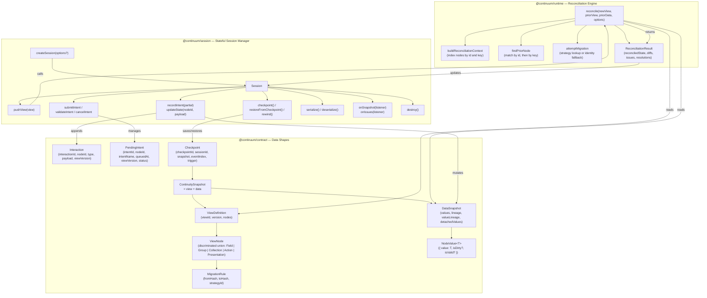
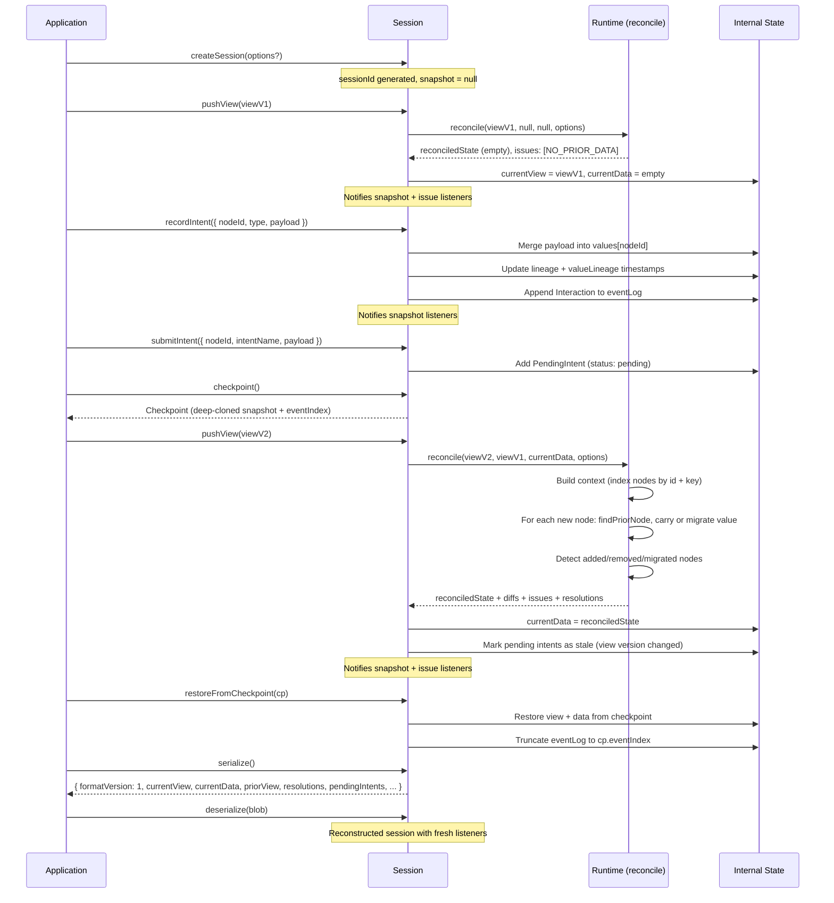

# Continuum Architecture

## Package Dependency & Structure

## Session Lifecycle Flow

## Summary

- **Contract** is the pure type layer. It defines the shapes for view definitions (node trees with migration rules), data snapshots (per-node values + lineage), continuity snapshots (view + data paired), interactions (event log entries), pending intents (uncommitted mutations with lifecycle), and checkpoints (restore points with a trigger of `'auto'` or `'manual'`).

- **Runtime** is the stateless reconciliation engine. Its single entry point, `reconcile`, takes a new view, an optional prior view, and optional prior data, then figures out which node values to carry forward, which need migration (via hash comparison and strategy lookup), and which are new or removed. It returns a new `DataSnapshot` plus diffs, issues, and resolutions.

- **Session** is the stateful orchestrator. It owns a session ID, manages the current view and data, and exposes the full API: pushing views (which triggers reconciliation via the runtime), recording user intents (which mutate data and append to the event log), managing pending intents (`submitIntent` / `validateIntent` / `cancelIntent`), creating/restoring checkpoints, subscribing to snapshot and issue changes, retrieving resolutions (`getResolutions`), and serializing/deserializing the entire session for persistence.

The core cycle is: **push a view** (runtime reconciles data) -> **record intents** (data updates + event log) -> **push a new view version** (runtime reconciles again, migrating or carrying values, marking stale intents) -> **checkpoint/restore** as needed.
