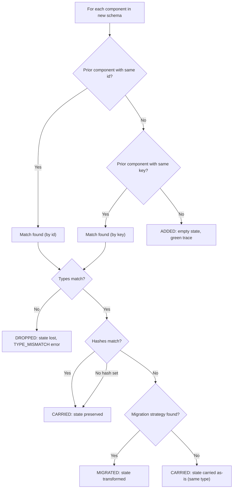

# Schema Contract Reference

The definitive reference for Continuum's schema format, reconciliation rules, state conventions, and serialization format.

---

## SchemaSnapshot

The top-level structure describing a UI at a point in time.

```typescript
interface SchemaSnapshot {
  schemaId: string;
  version: string;
  components: ComponentDefinition[];
}
```

| Field | Type | Required | Description |
|---|---|---|---|
| `schemaId` | `string` | yes | Stable identifier for the form. Stays the same across versions (e.g. `"loan-app"`). |
| `version` | `string` | yes | Version identifier. Should increment on each schema push (e.g. `"1.0"`, `"2.0"`). |
| `components` | `ComponentDefinition[]` | yes | Top-level components in render order. Can be empty. |

**Constraints:**

- `schemaId` should remain constant across versions of the same logical form
- `version` is compared by string equality (not numeric ordering) for checkpoint matching
- The same `schemaId` + `version` pair should always produce the same component tree

---

## ComponentDefinition

A single UI component within a schema.

```typescript
interface ComponentDefinition {
  id: string;
  type: string;
  key?: string;
  path?: string;
  hash?: string;
  stateType?: string;
  stateShape?: unknown;
  migrations?: MigrationRule[];
  children?: ComponentDefinition[];
}
```

| Field | Type | Required | Description |
|---|---|---|---|
| `id` | `string` | yes | Unique identifier within this schema version. May change across versions. |
| `type` | `string` | yes | Component type string. Maps to a React component in the component map. |
| `key` | `string` | no | Stable semantic key for matching across schema versions. If a component's `id` changes but its `key` stays the same, Continuum treats it as a rename and carries state. |
| `path` | `string` | no | Display label or hierarchical path. Used by adapters to store field labels. |
| `hash` | `string` | no | Schema shape hash. When a matched component's hash changes, Continuum looks for a migration rule. If absent, no hash-based migration occurs. |
| `stateType` | `string` | no | Hint about the expected state shape (e.g. `"text"`, `"selection"`). Informational only. |
| `stateShape` | `unknown` | no | Additional metadata about the component (e.g. dropdown options as `{ id, label }[]`). |
| `migrations` | `MigrationRule[]` | no | Declarative migration rules for hash transitions. |
| `children` | `ComponentDefinition[]` | no | Nested child components (for container/section types). Rendered recursively. |

### id vs key

- `id` is the **address** -- it uniquely identifies the component in this specific schema version
- `key` is the **identity** -- it semantically identifies what the component represents across versions

Example: renaming `first_name` to `given_name` (different `id`, same `key: 'first_name'`) preserves the user's input.

### Minimum Valid Component

The minimum contract for a component is `{ id, type }`. All other fields are optional:

```json
{ "id": "name", "type": "input" }
```

---

## MigrationRule

Declares how state should be migrated when a component's `hash` changes.

```typescript
interface MigrationRule {
  fromHash: string;
  toHash: string;
  strategyId?: string;
}
```

| Field | Type | Required | Description |
|---|---|---|---|
| `fromHash` | `string` | yes | Hash of the prior schema shape |
| `toHash` | `string` | yes | Hash of the new schema shape |
| `strategyId` | `string` | no | Key into the `strategyRegistry` in `ReconciliationOptions`. If absent, Continuum falls back to carrying state as-is. |

---

## Reconciliation Rules

When `pushSchema(newSchema)` is called with existing state, each component in the new schema is processed through this decision tree:



### Step-by-step

1. **Match by ID** -- look for a prior component with the same `id`
2. **Match by key** -- if no ID match, look for a prior component with the same `key`
3. **No match** -- component is new. Trace action: `added`. State is empty.
4. **Type check** -- if matched components have different `type`, state is **dropped**. Issue: `TYPE_MISMATCH` (error). Trace action: `dropped`.
5. **Hash check** -- if types match but `hash` values differ, attempt migration
6. **Migration** -- resolution order:
   - `ReconciliationOptions.migrationStrategies[componentId]` (per-component override)
   - `MigrationRule` on the definition + `ReconciliationOptions.strategyRegistry[rule.strategyId]`
   - Fallback: carry prior state as-is (same type assumed compatible)
   - If strategy returns `null`: state dropped, `MIGRATION_FAILED` issue
7. **Carry** -- if type and hash match (or no hash is set), state carries forward unchanged. Trace action: `carried`.
8. **Removed components** -- prior components not present in the new schema are logged as `COMPONENT_REMOVED` (warning). They appear in `diffs` but not in `trace` (which only covers new-schema components).

---

## State Shape Conventions

Continuum does not validate state shapes, but these are the conventional shapes per component type:

### ValueInputState

For text inputs, date inputs, textareas, sliders, and any value-based component.

```typescript
interface ValueInputState {
  value: string | number;
  isDirty?: boolean;
}
```

### ToggleState

For checkboxes, switches, and boolean toggles.

```typescript
interface ToggleState {
  checked: boolean;
}
```

### SelectionState

For dropdowns, radio groups, multi-selects, and any selection-based component.

```typescript
interface SelectionState {
  selectedIds: string[];
}
```

### ViewportState

For scrollable containers, expandable sections, and viewport-aware components.

```typescript
interface ViewportState {
  scrollX: number;
  scrollY: number;
  expanded?: boolean;
}
```

### Custom State

Any `Record<string, unknown>` is valid. The session stores it opaquely:

```typescript
session.updateState('chart', { zoom: 1.5, panX: 100, panY: 50 });
```

---

## Versioning Strategy

- `schemaId` stays constant for the lifetime of a form (e.g. `"loan-application"`)
- `version` increments with each push (e.g. `"1.0"` → `"2.0"` → `"3.0"`)
- Version changes trigger pending action staling (actions submitted against an old version are marked `stale`)
- Checkpoints record the version at the time of creation

There is no prescribed version format. Strings are compared by equality, not ordering.

---

## Serialization Format

`session.serialize()` produces a JSON-compatible object:

```typescript
{
  formatVersion: 1,             // format version for forward compatibility
  sessionId: string,            // unique session identifier
  currentSchema: SchemaSnapshot | null,
  currentState: StateSnapshot | null,
  priorSchema: SchemaSnapshot | null,
  eventLog: Interaction[],      // full interaction history
  pendingActions: PendingAction[],
  checkpoints: Checkpoint[],    // full checkpoint stack
  issues: ReconciliationIssue[],
  diffs: StateDiff[],
  trace: ReconciliationTrace[],
}
```

### Forward Compatibility

- `formatVersion` is checked on deserialization
- Missing `formatVersion` is accepted (legacy support)
- `formatVersion <= 1` is accepted
- `formatVersion > 1` throws an error

### Size Considerations

The serialized blob includes the full checkpoint stack. Each checkpoint contains a complete `ContinuitySnapshot` (schema + state). For long-lived sessions with many schema pushes, the blob can grow large. Consider periodically trimming checkpoints or using selective serialization for production use.
