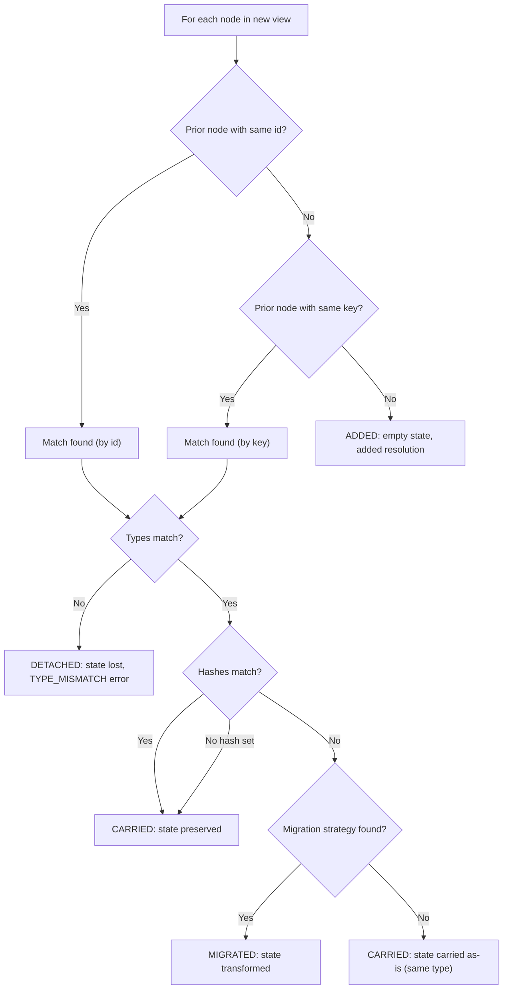

# Schema Contract Reference

The definitive reference for Continuum's view definition format, reconciliation rules, state conventions, and serialization format.

---

## ViewDefinition

The top-level structure describing a UI at a point in time.

```typescript
interface ViewDefinition {
  viewId: string;
  version: string;
  nodes: ViewNode[];
}
```

| Field | Type | Required | Description |
|---|---|---|---|
| `viewId` | `string` | yes | Stable identifier for the form. Stays the same across versions (e.g. `"loan-app"`). |
| `version` | `string` | yes | Version identifier. Should increment on each view push (e.g. `"1.0"`, `"2.0"`). |
| `nodes` | `ViewNode[]` | yes | Top-level nodes in render order. Can be empty. |

**Constraints:**

- `viewId` should remain constant across versions of the same logical form
- `version` is compared by string equality (not numeric ordering) for checkpoint matching
- The same `viewId` + `version` pair should always produce the same node tree

---

## ViewNode

A discriminated union of node types within a view definition.

```typescript
type ViewNode =
  | FieldNode
  | GroupNode
  | CollectionNode
  | ActionNode
  | PresentationNode;
```

### BaseNode

All node types share these fields:

```typescript
interface BaseNode {
  id: string;
  type: string;
  key?: string;
  hidden?: boolean;
  hash?: string;
  migrations?: MigrationRule[];
}
```

| Field | Type | Required | Description |
|---|---|---|---|
| `id` | `string` | yes | Unique identifier within this view version. May change across versions. |
| `type` | `string` | yes | Node type discriminator: `'field'`, `'group'`, `'collection'`, `'action'`, or `'presentation'`. |
| `key` | `string` | no | Stable semantic key for matching across view versions. If a node's `id` changes but its `key` stays the same, Continuum treats it as a rename and carries state. |
| `hidden` | `boolean` | no | If true, node is excluded from rendering in default renderer. |
| `hash` | `string` | no | View shape hash. When a matched node's hash changes, Continuum looks for a migration rule. If absent, no hash-based migration occurs. |
| `migrations` | `MigrationRule[]` | no | Declarative migration rules for hash transitions. |

### FieldNode

For text inputs, date inputs, number inputs, boolean toggles, and any value-based node.

```typescript
interface FieldNode extends BaseNode {
  type: 'field';
  dataType: 'string' | 'number' | 'boolean';
  label?: string;
  placeholder?: string;
  description?: string;
  readOnly?: boolean;
  defaultValue?: unknown;
  constraints?: FieldConstraints;
}

interface FieldConstraints {
  required?: boolean;
  min?: number;
  max?: number;
  minLength?: number;
  maxLength?: number;
  pattern?: string;
}
```

### GroupNode

For sections, cards, and container layouts with nested children.

```typescript
interface GroupNode extends BaseNode {
  type: 'group';
  label?: string;
  children: ViewNode[];
}
```

### CollectionNode

For repeatable/list items backed by a template node.

```typescript
interface CollectionNode extends BaseNode {
  type: 'collection';
  label?: string;
  template: ViewNode;
  minItems?: number;
  maxItems?: number;
}
```

### ActionNode

For buttons and intent triggers.

```typescript
interface ActionNode extends BaseNode {
  type: 'action';
  intentId: string;
  label: string;
  disabled?: boolean;
}
```

### PresentationNode

For read-only display content.

```typescript
interface PresentationNode extends BaseNode {
  type: 'presentation';
  contentType: 'text' | 'markdown';
  content: string;
}
```

### id vs key

- `id` is the **address** -- it uniquely identifies the node in this specific view version
- `key` is the **identity** -- it semantically identifies what the node represents across versions

Example: renaming `first_name` to `given_name` (different `id`, same `key: 'first_name'`) preserves the user's input.

### Minimum Valid Node

The minimum contract for a field node is `{ id, type, dataType }`:

```json
{ "id": "name", "type": "field", "dataType": "string" }
```

---

## MigrationRule

Declares how state should be migrated when a node's `hash` changes.

```typescript
interface MigrationRule {
  fromHash: string;
  toHash: string;
  strategyId?: string;
}
```

| Field | Type | Required | Description |
|---|---|---|---|
| `fromHash` | `string` | yes | Hash of the prior view shape |
| `toHash` | `string` | yes | Hash of the new view shape |
| `strategyId` | `string` | no | Key into the `strategyRegistry` in `ReconciliationOptions`. If absent, Continuum falls back to carrying state as-is. |

---

## Reconciliation Rules

When `pushView(newView)` is called with existing data, each node in the new view is processed through this decision tree:



### Step-by-step

1. **Match by ID** -- look for a prior node with the same `id`
2. **Match by key** -- if no ID match, look for a prior node with the same `key`
3. **No match** -- node is new. Resolution: `added`. State is empty.
4. **Type check** -- if matched nodes have different `type`, state is **detached**. Issue: `TYPE_MISMATCH` (error). Resolution: `detached`.
5. **Hash check** -- if types match but `hash` values differ, attempt migration
6. **Migration** -- resolution order:
   - `ReconciliationOptions.migrationStrategies[nodeId]` (per-node override)
   - `MigrationRule` on the definition + `ReconciliationOptions.strategyRegistry[rule.strategyId]`
   - Fallback: carry prior state as-is (same type assumed compatible)
   - `MIGRATION_FAILED` is issued when no strategy is available or strategy execution throws
7. **Carry** -- if type and hash match (or no hash is set), state carries forward unchanged. Resolution: `carried`.
8. **Removed nodes** -- prior nodes not present in the new view are logged as `NODE_REMOVED` (warning). They appear in `diffs` but not in `resolutions` (which only cover new-view nodes).

---

## NodeValue

The universal state shape for all value-bearing nodes.

```typescript
interface NodeValue<T = unknown> {
  value: T;
  isDirty?: boolean;
  isValid?: boolean;
}
```

All node types use `NodeValue<T>` where `T` matches the node's `dataType`:

| dataType | T | Example |
|---|---|---|
| `'string'` | `string` | `{ value: 'Alice' }` |
| `'number'` | `number` | `{ value: 42 }` |
| `'boolean'` | `boolean` | `{ value: true, isDirty: true }` |

Custom values are also valid -- the session stores them opaquely:

```typescript
session.updateState('chart', { zoom: 1.5, panX: 100, panY: 50 });
```

---

## DataSnapshot

The state container for an entire view.

```typescript
interface DataSnapshot {
  values: Record<string, NodeValue>;
  viewContext?: Record<string, ViewContext>;
  lineage: SnapshotLineage;
  valueLineage?: Record<string, ValueLineage>;
  detachedValues?: Record<string, DetachedValue>;
}

interface ViewContext {
  scrollX?: number;
  scrollY?: number;
  isExpanded?: boolean;
  isFocused?: boolean;
}

interface SnapshotLineage {
  timestamp: number;
  sessionId: string;
  viewId?: string;
  viewVersion?: string;
  viewHash?: string;
  lastInteractionId?: string;
}

interface ValueLineage {
  lastUpdated?: number;
  lastInteractionId?: string;
}

interface DetachedValue {
  value: unknown;
  previousNodeType: string;
  key?: string;
  detachedAt: number;
  viewVersion: string;
  reason: 'node-removed' | 'type-mismatch' | 'migration-failed';
}
```

---

## ContinuitySnapshot

The combined view + data at a point in time.

```typescript
interface ContinuitySnapshot {
  view: ViewDefinition;
  data: DataSnapshot;
}
```

---

## Versioning Strategy

- `viewId` stays constant for the lifetime of a form (e.g. `"loan-application"`)
- `version` increments with each push (e.g. `"1.0"` → `"2.0"` → `"3.0"`)
- Version changes trigger pending intent staling (intents submitted against an old version are marked `stale`)
- Checkpoints record the version at the time of creation

There is no prescribed version format. Strings are compared by equality, not ordering.

---

## Serialization Format

`session.serialize()` produces a JSON-compatible object:

```typescript
{
  formatVersion: 1,
  sessionId: string,
  currentView: ViewDefinition | null,
  currentData: DataSnapshot | null,
  priorView: ViewDefinition | null,
  eventLog: Interaction[],
  pendingIntents: PendingIntent[],
  checkpoints: Checkpoint[],
  issues: ReconciliationIssue[],
  diffs: StateDiff[],
  resolutions: ReconciliationResolution[],
  settings?: {
    allowBlindCarry?: boolean,
    allowPartialRestore?: boolean,
    validateOnUpdate?: boolean,
  },
}
```

### Forward Compatibility

- `formatVersion` is checked on deserialization
- Only `formatVersion: 1` is accepted (the current version)
- Missing `formatVersion` or any other value throws an error
- This is a v0 clean-slate release; no legacy format support

### Size Considerations

The serialized blob includes the full checkpoint stack. Each checkpoint contains a complete `ContinuitySnapshot` (view + data). For long-lived sessions with many view pushes, the blob can grow large. Consider periodically trimming checkpoints or using selective serialization for production use.
