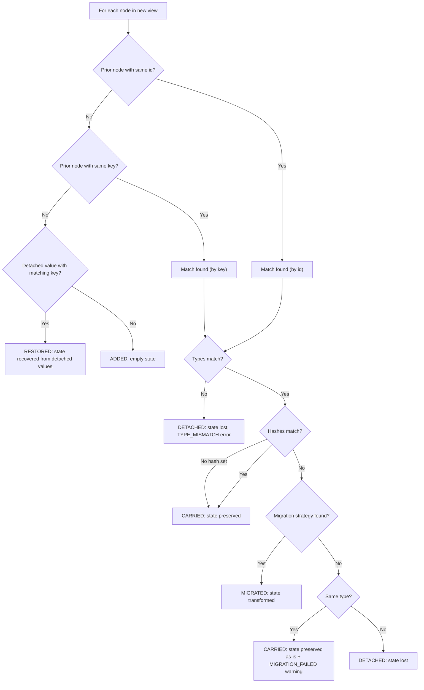

# View Contract Reference

The definitive reference for Continuum's view definition format, reconciliation rules, state conventions, and serialization format.

---

## ViewDefinition

The top-level structure describing a UI at a point in time.

```typescript
interface ViewDefinition {
  viewId: string;
  version: string;
  nodes: ViewNode[];
}
```

| Field     | Type         | Required | Description                                                                         |
| --------- | ------------ | -------- | ----------------------------------------------------------------------------------- |
| `viewId`  | `string`     | yes      | Stable identifier for the form. Stays the same across versions (e.g. `"loan-app"`). |
| `version` | `string`     | yes      | Version identifier. Should increment on each view push (e.g. `"1.0"`, `"2.0"`).    |
| `nodes`   | `ViewNode[]` | yes      | Top-level nodes in render order. Can be empty.                                      |

Constraints:

- `viewId` should remain constant across versions of the same logical form
- `version` is compared by string equality (not numeric ordering) for checkpoint matching
- The same `viewId` + `version` pair should always produce the same node tree

---

## ViewNode

A discriminated union of node types within a view definition.

```typescript
type ViewNode =
  | FieldNode
  | GroupNode
  | CollectionNode
  | ActionNode
  | PresentationNode
  | RowNode
  | GridNode;
```

### BaseNode

All node types share these fields:

```typescript
interface BaseNode {
  id: string;
  type: string;
  key?: string;
  hidden?: boolean;
  hash?: string;
  migrations?: MigrationRule[];
}
```

| Field        | Type              | Required | Description                                                                                                                                                      |
| ------------ | ----------------- | -------- | ---------------------------------------------------------------------------------------------------------------------------------------------------------------- |
| `id`         | `string`          | yes      | Unique identifier within this view version. May change across versions.                                                                                          |
| `type`       | `string`          | yes      | Node type discriminator: `'field'`, `'group'`, `'collection'`, `'action'`, `'presentation'`, `'row'`, or `'grid'`.                                               |
| `key`        | `string`          | no       | Stable semantic key for matching across view versions. If a node's `id` changes but its `key` stays the same, Continuum treats it as a rename and carries state. |
| `hidden`     | `boolean`         | no       | If true, node is excluded from rendering in default renderer.                                                                                                    |
| `hash`       | `string`          | no       | View shape hash. When a matched node's hash changes, Continuum looks for a migration rule. If absent, no hash-based migration occurs.                            |
| `migrations` | `MigrationRule[]` | no       | Declarative migration rules for hash transitions.                                                                                                                |

### id vs key

- `id` is the **address** -- it uniquely identifies the node in this specific view version
- `key` is the **identity** -- it semantically identifies what the node represents across versions

Example: renaming `first_name` to `given_name` (different `id`, same `key: 'first_name'`) preserves the user's input.

### FieldNode

For text inputs, date inputs, number inputs, boolean toggles, and any value-based node.

```typescript
interface FieldNode extends BaseNode {
  type: 'field';
  dataType: 'string' | 'number' | 'boolean';
  label?: string;
  placeholder?: string;
  description?: string;
  readOnly?: boolean;
  defaultValue?: unknown;
  constraints?: FieldConstraints;
  options?: FieldOption[];
}

interface FieldConstraints {
  required?: boolean;
  min?: number;
  max?: number;
  minLength?: number;
  maxLength?: number;
  pattern?: string;
}

interface FieldOption {
  value: string;
  label: string;
}
```

### GroupNode

For sections, cards, and container layouts with nested children.

```typescript
interface GroupNode extends BaseNode {
  type: 'group';
  label?: string;
  layout?: 'vertical' | 'horizontal' | 'grid';
  columns?: number;
  children: ViewNode[];
}
```

### CollectionNode

For repeatable/list items backed by a template node.

```typescript
interface CollectionNode extends BaseNode {
  type: 'collection';
  label?: string;
  template: ViewNode;
  minItems?: number;
  maxItems?: number;
  defaultValues?: Array<Record<string, unknown>>;
}
```

### ActionNode

For buttons and intent triggers.

```typescript
interface ActionNode extends BaseNode {
  type: 'action';
  intentId: string;
  label: string;
  disabled?: boolean;
}
```

When an `ActionNode` is activated, the runtime resolves the `intentId` against the
session's action registry. If a handler is registered, `dispatchAction(intentId, nodeId)`
is called and an `ActionResult` is returned. If no handler exists, a console warning
is emitted and `{ success: false }` is returned. Handlers receive an `ActionContext`
that includes a `session` reference (`ActionSessionRef`) for performing state mutations
such as `pushView`, `updateState`, `getSnapshot`, and `proposeValue`.

See the [Integration Guide](./INTEGRATION_GUIDE.md#6-action-execution) and
[AI Integration](./AI_INTEGRATION.md) docs for full examples.

### PresentationNode

For read-only display content.

```typescript
interface PresentationNode extends BaseNode {
  type: 'presentation';
  contentType: 'text' | 'markdown';
  content: string;
}
```

### RowNode

For horizontal layouts.

```typescript
interface RowNode extends BaseNode {
  type: 'row';
  children: ViewNode[];
}
```

### GridNode

For multi-column grid layouts.

```typescript
interface GridNode extends BaseNode {
  type: 'grid';
  columns?: number;
  children: ViewNode[];
}
```

### Minimum Valid Node

The minimum contract for a field node is `{ id, type, dataType }`:

```json
{ "id": "name", "type": "field", "dataType": "string" }
```

---

## MigrationRule

Declares how state should be migrated when a node's `hash` changes.

```typescript
interface MigrationRule {
  fromHash: string;
  toHash: string;
  strategyId?: string;
}
```

| Field        | Type     | Required | Description                                                                                                          |
| ------------ | -------- | -------- | -------------------------------------------------------------------------------------------------------------------- |
| `fromHash`   | `string` | yes      | Hash of the prior view shape.                                                                                        |
| `toHash`     | `string` | yes      | Hash of the new view shape.                                                                                          |
| `strategyId` | `string` | no       | Key into the `strategyRegistry` in `ReconciliationOptions`. If absent, Continuum falls back to carrying state as-is. |

### MigrationStrategy

```typescript
type MigrationStrategy = (
  nodeId: string,
  priorNode: ViewNode,
  newNode: ViewNode,
  priorValue: unknown
) => unknown;
```

---

## Reconciliation Rules

When `pushView(newView)` is called with existing data, each node in the new view is processed through this decision tree:



### Matching Order

Node matching in `findPriorNode` follows this priority:

1. **Exact full-path ID** -- matches the scoped path-qualified ID (e.g. `billing/name`)
2. **Exact raw ID** -- matches by the bare `id` field
3. **Exact key** -- scope-qualified key match (`parentPath/key`)
4. **Dot-notation suffix key** -- if the key contains dots, tries the last segment as a key
5. **Unique raw ID mapping** -- if only one prior node shares the same raw ID, it matches
6. **Dot-notation suffix ID** -- tries the last segment of a dotted key as a raw ID lookup

### Step-by-step

1. **Match by ID** -- look for a prior node with the same path-qualified `id`
2. **Match by key** -- if no ID match, look for a prior node with the same scope-qualified `key`
3. **No match** -- node is new. Check detached values for restoration, otherwise resolution: `added`. State is empty.
4. **Type check** -- if matched nodes have different `type`, state is **detached**. Issue: `TYPE_MISMATCH` (error). Resolution: `detached`.
5. **Hash check** -- if types match but `hash` values differ, attempt migration
6. **Migration** -- resolution order:
   - `ReconciliationOptions.migrationStrategies[nodeId]` (per-node override)
   - Direct `MigrationRule` match (`fromHash` -> `toHash`) + `ReconciliationOptions.strategyRegistry[rule.strategyId]`
   - Multi-step migration chain via rule path (BFS, max chain depth: 10)
   - Same-type fallback: carry prior state as-is with `MIGRATION_FAILED` warning
   - Different-type with no strategy: detach
7. **Carry** -- if type and hash match (or no hash is set), state carries forward unchanged. Resolution: `carried`.
8. **Removed nodes** -- prior nodes not present in the new view are logged as `NODE_REMOVED` (warning). They appear in `diffs` but not in `resolutions` (which only cover new-view nodes). Removed values are stored as detached values for potential future restoration.

### ReconciliationOptions

```typescript
interface ReconciliationOptions {
  allowPartialRestore?: boolean;
  allowBlindCarry?: boolean;
  migrationStrategies?: Record<string, MigrationStrategy>;
  strategyRegistry?: Record<string, MigrationStrategy>;
  clock?: () => number;
}
```

| Field                  | Type                                  | Description                                                                                   |
| ---------------------- | ------------------------------------- | --------------------------------------------------------------------------------------------- |
| `allowPartialRestore`  | `boolean`                             | Suppresses `NODE_REMOVED` warnings for partial restoration workflows.                         |
| `allowBlindCarry`      | `boolean`                             | When `priorView` is null, carries values by matching raw node IDs and keys.                   |
| `migrationStrategies`  | `Record<string, MigrationStrategy>`   | Per-node migration overrides keyed by the new node ID.                                        |
| `strategyRegistry`     | `Record<string, MigrationStrategy>`   | Named migration functions referenced by `MigrationRule.strategyId`.                           |
| `clock`                | `() => number`                        | Time source for lineage and detached value timestamps.                                        |

---

## Data Resolutions

When a node undergoes reconciliation, its state is assigned a resolution:

```typescript
const DATA_RESOLUTIONS = {
  CARRIED: 'carried',
  MIGRATED: 'migrated',
  DETACHED: 'detached',
  ADDED: 'added',
  RESTORED: 'restored',
} as const;
```

| Resolution   | Meaning                                                                            |
| ------------ | ---------------------------------------------------------------------------------- |
| `added`      | A new node where no prior state existed.                                           |
| `carried`    | Prior state was carried forward as-is (by ID or key match).                        |
| `migrated`   | Prior state was successfully transformed via a migration strategy.                 |
| `detached`   | Prior state was detached on incompatible type transitions.                         |
| `restored`   | State was restored from detached values when a compatible node returned.           |

### ReconciliationResolution

```typescript
interface ReconciliationResolution {
  nodeId: string;
  priorId: string | null;
  matchedBy: 'id' | 'key' | null;
  priorType: string | null;
  newType: string;
  resolution: DataResolution;
  priorValue: unknown;
  reconciledValue: unknown;
}
```

---

## View Diffs

Changes to the view structure are captured in `diffs`:

```typescript
const VIEW_DIFFS = {
  ADDED: 'added',
  REMOVED: 'removed',
  MIGRATED: 'migrated',
  TYPE_CHANGED: 'type-changed',
  RESTORED: 'restored',
} as const;
```

| Diff           | Meaning                                                      |
| -------------- | ------------------------------------------------------------ |
| `added`        | A node was added in the new view.                            |
| `removed`      | A node from the prior view is missing in the new view.       |
| `migrated`     | A node's hash changed and it was migrated.                   |
| `type-changed` | A node's type changed, breaking state continuity.            |
| `restored`     | A node was restored from detached values.                    |

### StateDiff

```typescript
interface StateDiff {
  nodeId: string;
  type: ViewDiff;
  oldValue?: unknown;
  newValue?: unknown;
  reason?: string;
}
```

---

## Issue Codes

During reconciliation and validation, warnings and errors are recorded as issues.

```typescript
const ISSUE_CODES = {
  NO_PRIOR_DATA: 'NO_PRIOR_DATA',
  NO_PRIOR_VIEW: 'NO_PRIOR_VIEW',
  TYPE_MISMATCH: 'TYPE_MISMATCH',
  NODE_REMOVED: 'NODE_REMOVED',
  MIGRATION_FAILED: 'MIGRATION_FAILED',
  UNVALIDATED_CARRY: 'UNVALIDATED_CARRY',
  VALIDATION_FAILED: 'VALIDATION_FAILED',
  UNKNOWN_NODE: 'UNKNOWN_NODE',
  DUPLICATE_NODE_ID: 'DUPLICATE_NODE_ID',
  DUPLICATE_NODE_KEY: 'DUPLICATE_NODE_KEY',
  VIEW_CHILD_CYCLE_DETECTED: 'VIEW_CHILD_CYCLE_DETECTED',
  VIEW_MAX_DEPTH_EXCEEDED: 'VIEW_MAX_DEPTH_EXCEEDED',
  COLLECTION_CONSTRAINT_VIOLATED: 'COLLECTION_CONSTRAINT_VIOLATED',
  SCOPE_COLLISION: 'SCOPE_COLLISION',
} as const;

const ISSUE_SEVERITY = {
  ERROR: 'error',
  WARNING: 'warning',
  INFO: 'info',
} as const;
```

| Code                              | Severity  | Description                                                                  |
| --------------------------------- | --------- | ---------------------------------------------------------------------------- |
| `NO_PRIOR_DATA`                   | info      | Reconciling with no prior data snapshot (first push).                        |
| `NO_PRIOR_VIEW`                   | warning   | Reconciling with no prior view definition (blind carry mode).                |
| `TYPE_MISMATCH`                   | error     | A matched node has a different `type`. State is detached.                    |
| `NODE_REMOVED`                    | warning   | A prior node is absent from the new view.                                   |
| `MIGRATION_FAILED`                | warning   | A migration strategy was required but missing, or execution threw.           |
| `UNVALIDATED_CARRY`               | info      | State was carried over during blind carry without validation.                |
| `VALIDATION_FAILED`               | warning   | A node's state failed constraint validation.                                |
| `UNKNOWN_NODE`                    | warning   | A state update referenced a node not in the active view.                    |
| `DUPLICATE_NODE_ID`               | error     | Multiple nodes share the same scoped `id`.                                  |
| `DUPLICATE_NODE_KEY`              | warning   | Multiple nodes share the same scoped `key`.                                 |
| `VIEW_CHILD_CYCLE_DETECTED`       | error     | A circular reference was detected in group/container children.               |
| `VIEW_MAX_DEPTH_EXCEEDED`         | error     | View structure exceeds the max nesting depth (default: 128).                 |
| `COLLECTION_CONSTRAINT_VIOLATED`  | warning   | A collection node violates `minItems`/`maxItems` constraints.                |
| `SCOPE_COLLISION`                 | error     | Name/key collision in resolution scope.                                      |

### ReconciliationIssue

```typescript
interface ReconciliationIssue {
  severity: IssueSeverity;
  nodeId?: string;
  message: string;
  code: IssueCode;
}
```

---

## NodeValue

The universal state shape for all value-bearing nodes.

```typescript
interface NodeValue<T = unknown> {
  value: T;
  suggestion?: T;
  isDirty?: boolean;
  isValid?: boolean;
}
```

All node types use `NodeValue<T>` where `T` matches the node's `dataType`:

| dataType    | T         | Example                          |
| ----------- | --------- | -------------------------------- |
| `'string'`  | `string`  | `{ value: 'Alice' }`            |
| `'number'`  | `number`  | `{ value: 42 }`                 |
| `'boolean'` | `boolean` | `{ value: true, isDirty: true }`|

The `suggestion` field holds a proposed value (from AI, migration, or `defaultValues`) that the user can accept or reject.

Custom values are also valid -- the session stores them opaquely:

```typescript
session.updateState('chart', { zoom: 1.5, panX: 100, panY: 50 });
```

### CollectionNodeState

Collections store their items as an array of per-item value maps:

```typescript
interface CollectionItemState {
  values: Record<string, NodeValue>;
}

interface CollectionNodeState {
  items: CollectionItemState[];
}
```

---

## DataSnapshot

The state container for an entire view.

```typescript
interface DataSnapshot {
  values: Record<string, NodeValue>;
  viewContext?: Record<string, ViewportState>;
  lineage: SnapshotLineage;
  valueLineage?: Record<string, ValueLineage>;
  detachedValues?: Record<string, DetachedValue>;
}
```

### ViewportState

Per-node viewport/UI state not tied to data values.

```typescript
interface ViewportState {
  scrollX?: number;
  scrollY?: number;
  zoom?: number;
  offsetX?: number;
  offsetY?: number;
  isExpanded?: boolean;
  isFocused?: boolean;
}
```

### SnapshotLineage

Provenance metadata for the snapshot.

```typescript
interface SnapshotLineage {
  timestamp: number;
  sessionId: string;
  viewId?: string;
  viewVersion?: string;
  viewHash?: string;
  lastInteractionId?: string;
}
```

### ValueLineage

Per-node provenance.

```typescript
interface ValueLineage {
  lastUpdated?: number;
  lastInteractionId?: string;
}
```

### DetachedValue

State preserved from nodes that were removed or had type changes.

```typescript
interface DetachedValue {
  value: unknown;
  previousNodeType: string;
  key?: string;
  detachedAt: number;
  viewVersion: string;
  reason: 'node-removed' | 'type-mismatch' | 'migration-failed';
  pushesSinceDetach?: number;
}
```

### DetachedValuePolicy

Controls garbage collection of detached values.

```typescript
interface DetachedValuePolicy {
  maxAge?: number;
  maxCount?: number;
  pushCount?: number;
}
```

---

## ContinuitySnapshot

The combined view + data at a point in time.

```typescript
interface ContinuitySnapshot {
  view: ViewDefinition;
  data: DataSnapshot;
}
```

---

## Interactions

### Interaction

An event log entry recording a user or system action.

```typescript
interface Interaction {
  interactionId: string;
  sessionId: string;
  nodeId: string;
  type: InteractionType;
  payload: unknown;
  timestamp: number;
  viewVersion: string;
}
```

### InteractionType

```typescript
const INTERACTION_TYPES = {
  DATA_UPDATE: 'data-update',
  VALUE_CHANGE: 'value-change',
  VIEW_CONTEXT_CHANGE: 'view-context-change',
} as const;

type InteractionType = 'data-update' | 'value-change' | 'view-context-change';
```

### PendingIntent

An uncommitted action with a lifecycle.

```typescript
interface PendingIntent {
  intentId: string;
  nodeId: string;
  intentName: string;
  payload: unknown;
  queuedAt: number;
  viewVersion: string;
  status: IntentStatus;
}
```

### IntentStatus

```typescript
const INTENT_STATUS = {
  PENDING: 'pending',
  VALIDATED: 'validated',
  STALE: 'stale',
  CANCELLED: 'cancelled',
} as const;

type IntentStatus = 'pending' | 'validated' | 'stale' | 'cancelled';
```

Intent lifecycle:

- `pending` -- submitted, awaiting validation
- `validated` -- confirmed valid for execution
- `stale` -- marked stale when a new view version is pushed (only affects `pending` intents)
- `cancelled` -- explicitly cancelled

---

## Checkpoints

```typescript
interface Checkpoint {
  checkpointId: string;
  sessionId: string;
  snapshot: ContinuitySnapshot;
  eventIndex: number;
  timestamp: number;
  trigger: 'auto' | 'manual';
}
```

- **Auto checkpoints** are created on every `pushView` call, capped by `maxCheckpoints` (default: 50). When the cap is exceeded, the oldest auto checkpoint is removed first.
- **Manual checkpoints** are created by calling `session.checkpoint()`.
- `restoreFromCheckpoint` restores view + data from the checkpoint, truncates the event log, and clears issues, diffs, resolutions, and pending intents.
- `rewind(checkpointId)` restores to the given checkpoint and removes all checkpoints after it.

---

## Versioning Strategy

- `viewId` stays constant for the lifetime of a form (e.g. `"loan-application"`)
- `version` increments with each push (e.g. `"1.0"` -> `"2.0"` -> `"3.0"`)
- Version changes trigger pending intent staling (intents with `pending` status are marked `stale`)
- Checkpoints record the version at the time of creation

There is no prescribed version format. Strings are compared by equality, not ordering.

---

## Serialization Format

`session.serialize()` produces a JSON-compatible object:

```typescript
{
  formatVersion: 1,
  sessionId: string,
  currentView: ViewDefinition | null,
  currentData: DataSnapshot | null,
  priorView: ViewDefinition | null,
  eventLog: Interaction[],
  pendingIntents: PendingIntent[],
  checkpoints: Checkpoint[],
  issues: ReconciliationIssue[],
  diffs: StateDiff[],
  resolutions: ReconciliationResolution[],
  settings: {
    allowBlindCarry?: boolean,
    allowPartialRestore?: boolean,
    validateOnUpdate?: boolean,
  },
}
```

### Deserialization Validation

`deserialize(blob)` validates:

- Payload must be an object
- `sessionId` must be a string
- `formatVersion` when present must be a number, and must equal `1`
- `currentView`, `currentData`, `priorView` must be objects or null
- `eventLog`, `pendingIntents`, `checkpoints`, `issues`, `diffs`, `resolutions` must be arrays
- Each event log entry's `type` must be a valid `InteractionType`

Invalid blobs fail fast with explicit errors.

### Deserialization Limits

`deserialize` accepts optional limits that cap restored collection sizes:

| Limit               | Default | Description                              |
| ------------------- | ------- | ---------------------------------------- |
| `maxEventLogSize`   | 1000    | Max event log entries to restore.        |
| `maxPendingIntents` | 500     | Max pending intents to restore.          |
| `maxCheckpoints`    | 50      | Max checkpoints to restore.              |

### Forward Compatibility

- `formatVersion` is checked on deserialization
- Missing `formatVersion` is accepted for backward compatibility
- When present, only `formatVersion: 1` is accepted; any other value throws

### Size Considerations

The serialized blob includes the full checkpoint stack. Each checkpoint contains a complete `ContinuitySnapshot` (view + data). For long-lived sessions with many view pushes, the blob can grow. The `maxCheckpoints` limit (default 50) and `DetachedValuePolicy` garbage collection help bound this growth.

---

## View Traversal Safety

The runtime uses an iterative view walker with two safety mechanisms:

- **Cycle detection** -- tracks active nodes on the current traversal path. If a node is re-entered, a `VIEW_CHILD_CYCLE_DETECTED` error is emitted and traversal stops for that branch.
- **Max depth guard** -- default limit of 128 levels. Nodes exceeding this depth emit a `VIEW_MAX_DEPTH_EXCEEDED` error.

Node IDs are scoped by parent path during traversal (e.g. `billing/name`, `shipping/name`), preventing cross-branch collisions.
