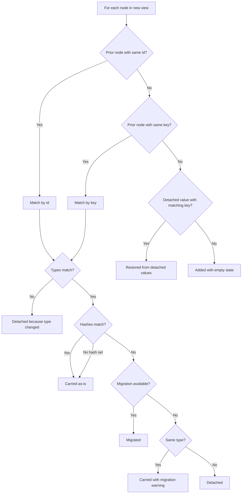

# View Contract Reference

The complete reference for Continuum’s view model, reconciliation behavior, and serialized session shape.

Use this guide when you need exact contract details. If you are just getting started, begin with [Quick Start](./QUICK_START.md).

## The mental model

Continuum separates two things:

- the **view**, which describes what should be rendered now
- the **data**, which represents user intent accumulated over time

When you call `pushView(newView)`, Continuum reconciles the current data against the new structure instead of throwing everything away.

## 1. `ViewDefinition`

`ViewDefinition` is the top-level contract for a renderable screen or workflow state.

```ts
interface ViewDefinition {
  viewId: string;
  version: string;
  nodes: ViewNode[];
}
```

| Field | Type | Required | Meaning |
| --- | --- | --- | --- |
| `viewId` | `string` | yes | Stable identifier for the logical workflow |
| `version` | `string` | yes | Version label for this specific view shape |
| `nodes` | `ViewNode[]` | yes | Top-level nodes in render order |

Rules:

- keep `viewId` stable across versions of the same workflow
- change `version` when the structure changes
- do not rely on numeric version ordering; Continuum compares version strings by equality
- the same `viewId` plus `version` should always describe the same node tree

### Smallest valid example

```json
{
  "viewId": "profile-form",
  "version": "1",
  "nodes": [
    { "id": "name", "type": "field", "dataType": "string" }
  ]
}
```

## 2. `ViewNode`

Continuum supports these node types:

```ts
type ViewNode =
  | FieldNode
  | GroupNode
  | CollectionNode
  | ActionNode
  | PresentationNode
  | RowNode
  | GridNode;
```

### Shared base fields

```ts
interface BaseNode {
  id: string;
  type: string;
  key?: string;
  hidden?: boolean;
  hash?: string;
  migrations?: MigrationRule[];
}
```

| Field | Type | Required | Meaning |
| --- | --- | --- | --- |
| `id` | `string` | yes | Unique identifier for this node in this view version |
| `type` | `string` | yes | Node discriminator |
| `key` | `string` | no | Stable semantic identity across versions |
| `hidden` | `boolean` | no | Whether the default renderer should hide the node |
| `hash` | `string` | no | Shape hash used to decide when migration is needed |
| `migrations` | `MigrationRule[]` | no | Declarative migration rules for hash transitions |

### `id` vs `key`

This is one of the most important Continuum concepts:

- `id` is the node’s address in the current view
- `key` is the node’s semantic identity across view changes

If a field changes from `id: 'first_name'` to `id: 'given_name'` but keeps `key: 'first_name'`, Continuum can preserve the user’s value because the meaning stayed the same.

## 3. Node type reference

### `FieldNode`

Use for editable values such as text, numbers, booleans, dates, and option fields.

```ts
interface FieldNode extends BaseNode {
  type: 'field';
  dataType: 'string' | 'number' | 'boolean';
  label?: string;
  placeholder?: string;
  description?: string;
  readOnly?: boolean;
  defaultValue?: unknown;
  constraints?: FieldConstraints;
  options?: FieldOption[];
}

interface FieldConstraints {
  required?: boolean;
  min?: number;
  max?: number;
  minLength?: number;
  maxLength?: number;
  pattern?: string;
}

interface FieldOption {
  value: string;
  label: string;
}
```

### `GroupNode`

Use for sections or containers with nested children.

```ts
interface GroupNode extends BaseNode {
  type: 'group';
  label?: string;
  layout?: 'vertical' | 'horizontal' | 'grid';
  columns?: number;
  children: ViewNode[];
}
```

### `CollectionNode`

Use for repeatable groups of item state.

```ts
interface CollectionNode extends BaseNode {
  type: 'collection';
  label?: string;
  template: ViewNode;
  minItems?: number;
  maxItems?: number;
  defaultValues?: Array<Record<string, unknown>>;
}
```

### `ActionNode`

Use for buttons or intent triggers.

```ts
interface ActionNode extends BaseNode {
  type: 'action';
  intentId: string;
  label: string;
  disabled?: boolean;
}
```

When an `ActionNode` is triggered, Continuum resolves `intentId` against the session action registry. Registered handlers receive an action context that includes the current snapshot and a session reference.

### `PresentationNode`

Use for read-only content.

```ts
interface PresentationNode extends BaseNode {
  type: 'presentation';
  contentType: 'text' | 'markdown';
  content: string;
}
```

### `RowNode`

Use for horizontal layouts.

```ts
interface RowNode extends BaseNode {
  type: 'row';
  children: ViewNode[];
}
```

### `GridNode`

Use for multi-column layouts.

```ts
interface GridNode extends BaseNode {
  type: 'grid';
  columns?: number;
  children: ViewNode[];
}
```

## 4. Reconciliation behavior

When `pushView(newView)` runs, Continuum reconciles each new node against prior state.

### High-level decision tree



### Matching order

The runtime tries to find prior nodes in this order:

1. exact scoped full-path `id`
2. exact raw `id`
3. exact scoped `key`
4. dot-notation suffix key
5. unique raw `id` mapping
6. dot-notation suffix `id`

### What the outcomes mean

| Outcome | Meaning |
| --- | --- |
| `added` | New node with no recoverable prior state |
| `carried` | Prior state preserved as-is |
| `migrated` | Prior state transformed by a migration strategy |
| `detached` | Prior state could not safely continue |
| `restored` | State was recovered from detached storage |

### Important details

- a type mismatch produces a `TYPE_MISMATCH` error and detaches the old value
- removed nodes are recorded in diffs and detached-value storage
- when hashes differ, Continuum looks for migration rules before falling back

## 5. Migration rules

Use migrations when the meaning of a node remains the same but the stored value shape must change.

```ts
interface MigrationRule {
  fromHash: string;
  toHash: string;
  strategyId?: string;
}

type MigrationStrategy = (
  context: {
    nodeId: string;
    priorNode: ViewNode;
    newNode: ViewNode;
    priorValue: unknown;
  }
) => unknown;
```

`strategyId` points into `ReconciliationOptions.strategyRegistry`.

### Reconciliation options

```ts
interface ReconciliationOptions {
  allowPartialRestore?: boolean;
  allowPriorDataWithoutPriorView?: boolean;
  migrationStrategies?: Record<string, MigrationStrategy>;
  strategyRegistry?: Record<string, MigrationStrategy>;
  clock?: () => number;
}
```

| Field | Type | Meaning |
| --- | --- | --- |
| `allowPartialRestore` | `boolean` | Suppresses `NODE_REMOVED` warnings for partial-restore workflows |
| `allowPriorDataWithoutPriorView` | `boolean` | When `priorView` is null but `priorData` exists, best-effort copy of prior values only where scoped node ids exist in the new view (not key-based) |
| `migrationStrategies` | `Record<string, MigrationStrategy>` | Per-node migration overrides keyed by new node id |
| `strategyRegistry` | `Record<string, MigrationStrategy>` | Named strategies referenced by migration rules |
| `clock` | `() => number` | Custom time source for lineage metadata |

## 6. Diagnostics surfaced by reconciliation

### Resolutions

```ts
interface ReconciliationResolution {
  nodeId: string;
  priorId: string | null;
  matchedBy: 'id' | 'key' | null;
  priorType: string | null;
  newType: string;
  resolution: DataResolution;
  priorValue: unknown;
  reconciledValue: unknown;
}
```

### Diffs

```ts
interface StateDiff {
  nodeId: string;
  type: ViewDiff;
  oldValue?: unknown;
  newValue?: unknown;
  reason?: string;
}
```

Common diff kinds:

- `added`
- `removed`
- `migrated`
- `type-changed`
- `restored`

### Issues

```ts
interface ReconciliationIssue {
  severity: IssueSeverity;
  nodeId?: string;
  message: string;
  code: IssueCode;
}
```

Common issue codes:

| Code | Severity | Meaning |
| --- | --- | --- |
| `NO_PRIOR_DATA` | info | First reconciliation with no prior data |
| `NO_PRIOR_VIEW` | warning | Carry attempted without a prior view |
| `TYPE_MISMATCH` | error | Matched node changed type |
| `NODE_REMOVED` | warning | Node existed before but not in the new view |
| `MIGRATION_FAILED` | warning | A needed migration was missing or threw |
| `VALIDATION_FAILED` | warning | Node value failed validation |
| `UNKNOWN_NODE` | warning | State update referenced a node not in the active view |
| `DUPLICATE_NODE_ID` | error | Multiple nodes share the same scoped id |
| `DUPLICATE_NODE_KEY` | warning | Multiple nodes share the same scoped key |
| `VIEW_CHILD_CYCLE_DETECTED` | error | A circular child reference was detected |
| `VIEW_MAX_DEPTH_EXCEEDED` | error | View depth exceeded the safety limit |
| `COLLECTION_CONSTRAINT_VIOLATED` | warning | Collection violated min or max item limits |
| `SCOPE_COLLISION` | error | Scoped name or key collision occurred |

## 7. Data model

### `NodeValue`

This is the standard state shape for value-bearing nodes.

```ts
interface NodeValue<T = unknown> {
  value: T;
  suggestion?: T;
  isDirty?: boolean;
  isValid?: boolean;
}
```

Typical mappings:

| `dataType` | Stored value |
| --- | --- |
| `'string'` | `{ value: string }` |
| `'number'` | `{ value: number }` |
| `'boolean'` | `{ value: boolean }` |

`suggestion` is used for proposal-based flows where a value is staged rather than immediately accepted.

### Collection state

```ts
interface CollectionItemState {
  values: Record<string, NodeValue>;
}

interface CollectionNodeState {
  items: CollectionItemState[];
}
```

### `DataSnapshot`

```ts
interface DataSnapshot {
  values: Record<string, NodeValue>;
  viewContext?: Record<string, ViewportState>;
  lineage: SnapshotLineage;
  valueLineage?: Record<string, ValueLineage>;
  detachedValues?: Record<string, DetachedValue>;
}
```

### `DetachedValue`

Detached values preserve state from nodes that were removed or became incompatible.

```ts
interface DetachedValue {
  value: unknown;
  previousNodeType: string;
  key?: string;
  detachedAt: number;
  viewVersion: string;
  reason: 'node-removed' | 'type-mismatch' | 'migration-failed';
  pushesSinceDetach?: number;
}
```

## 8. Session snapshots, intents, and checkpoints

### `ContinuitySnapshot`

```ts
interface ContinuitySnapshot {
  view: ViewDefinition;
  data: DataSnapshot;
}
```

### Interactions

```ts
interface Interaction {
  interactionId: string;
  sessionId: string;
  nodeId: string;
  type: InteractionType;
  payload: unknown;
  timestamp: number;
  viewVersion: string;
}
```

```ts
type InteractionType = 'data-update' | 'value-change' | 'view-context-change';
```

### Pending intents

```ts
interface PendingIntent {
  intentId: string;
  nodeId: string;
  intentName: string;
  payload: unknown;
  queuedAt: number;
  viewVersion: string;
  status: IntentStatus;
}

type IntentStatus = 'pending' | 'validated' | 'stale' | 'cancelled';
```

Intent lifecycle:

- `pending`: submitted and waiting
- `validated`: completed successfully
- `stale`: invalidated by a later view version
- `cancelled`: explicitly cancelled or failed through the audited lifecycle

### Checkpoints

```ts
interface Checkpoint {
  checkpointId: string;
  sessionId: string;
  snapshot: ContinuitySnapshot;
  eventIndex: number;
  timestamp: number;
  trigger: 'auto' | 'manual';
}
```

Checkpoint behavior:

- every `pushView` creates an auto-checkpoint
- `session.checkpoint()` creates a manual checkpoint
- `restoreFromCheckpoint` restores a snapshot without deleting later checkpoints
- `rewind(checkpointId)` restores a checkpoint and removes all checkpoints after it

## 9. Serialization

`session.serialize()` returns a JSON-compatible object shaped like this:

```ts
{
  formatVersion: 1,
  sessionId: string,
  currentView: ViewDefinition | null,
  currentData: DataSnapshot | null,
  priorView: ViewDefinition | null,
  eventLog: Interaction[],
  pendingIntents: PendingIntent[],
  checkpoints: Checkpoint[],
  issues: ReconciliationIssue[],
  diffs: StateDiff[],
  resolutions: ReconciliationResolution[],
  settings: {
    allowPriorDataWithoutPriorView?: boolean,
    allowPartialRestore?: boolean,
    validateOnUpdate?: boolean,
  },
}
```

Serialized blobs may still contain `settings.allowBlindCarry` from older saves; session deserialization maps that to `allowPriorDataWithoutPriorView`.

### Deserialization guarantees

`deserialize(blob)` validates:

- the payload is an object
- `sessionId` is a string
- `formatVersion`, when present, is `1`
- core collection fields are arrays
- object-or-null fields are valid

Invalid payloads fail fast with explicit errors.

### Limits

Optional restore limits:

| Limit | Default | Meaning |
| --- | --- | --- |
| `maxEventLogSize` | `1000` | Max restored event log entries |
| `maxPendingIntents` | `500` | Max restored pending intents |
| `maxCheckpoints` | `50` | Max restored checkpoints |

### Compatibility

- missing `formatVersion` is accepted for backward compatibility
- when present, only `formatVersion: 1` is accepted

## 10. Traversal safety

The runtime protects itself during view traversal with:

- cycle detection, which emits `VIEW_CHILD_CYCLE_DETECTED`
- a max depth guard, which emits `VIEW_MAX_DEPTH_EXCEEDED`

Scoped node ids such as `billing/name` and `shipping/name` prevent cross-branch collisions during traversal.
