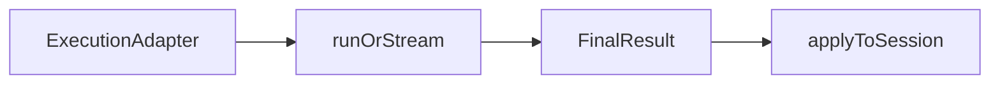

# @continuum-dev/ai-engine

Transport-agnostic Continuum **AI execution**: turn a user instruction into planner-driven **state**, **patch**, **transform**, or **view** results, with prompts, normalization, and guardrails handled inside the library.

## Features

- One pipeline for state / patch / transform / view across backends, agents, or apps
- Authoring helpers for **line-dsl**, **yaml**, and optional **view-json** (structured `ViewDefinition` JSON), plus parsers to `ViewDefinition`
- State and patch **target catalogs** and parsing for model JSON replies
- View **guardrails** and patch planning helpers
- Optional **`applyContinuumExecutionFinalResult`** when you use a Continuum **session**

## Installation

```bash
npm install @continuum-dev/ai-engine
```

This package already depends on `@continuum-dev/core`, `@continuum-dev/runtime`, `@continuum-dev/prompts`, and `@continuum-dev/protocol`. You usually do not install those separately, but you will still see types from `core` (for example `ViewDefinition`) in APIs.

Most app integrations pair this package with:

- `@continuum-dev/react` or `@continuum-dev/starter-kit` for rendering and live session state
- `@continuum-dev/session` when the app needs the explicit stateful spine
- `@continuum-dev/vercel-ai-sdk-adapter` or `@continuum-dev/ai-connect` for the outer AI edge

## Quick start (session + model adapter)

Typical integration: a **Continuum session adapter**, context from the session, an execution adapter from **`@continuum-dev/ai-connect`** (or your own — see below), then run and apply.

```ts
import {
  applyContinuumExecutionFinalResult,
  buildContinuumExecutionContext,
  type ContinuumViewAuthoringFormat,
  runContinuumExecution,
} from '@continuum-dev/ai-engine';
import { createAiConnectContinuumExecutionAdapter } from '@continuum-dev/ai-connect';

const authoringFormat: ContinuumViewAuthoringFormat = 'line-dsl';

const result = await runContinuumExecution({
  adapter: createAiConnectContinuumExecutionAdapter(provider),
  context: buildContinuumExecutionContext(session),
  instruction: 'Refine the existing intake flow for mobile',
  mode: 'evolve-view',
  authoringFormat,
});

applyContinuumExecutionFinalResult(session, result);
```

- `session` must be a `ContinuumSessionAdapter` (often via `createContinuumSessionAdapter` wrapping your session implementation).
- `mode` is an optional authoring hint (`create-view`, `evolve-view`, …). If you omit it, behavior is inferred from whether a view already exists.
- `authoringFormat` is `'line-dsl'`, `'yaml'`, or `'view-json'`. Use **`view-json`** when you want JSON that matches the built-in `ViewDefinition` schema: the engine sets `outputContract` to that schema on the execution request (this is what `@continuum-dev/ai-connect` forwards to providers). `outputKind: 'json-object'` on the same request is a **hint for routing and traces**; it does not enforce structure without a transport that honors `outputContract`. View generation uses **`generate` only** for `view-json` (no incremental `streamText` previews). If the provider rejects the schema, ai-connect clients **retry once without** the contract and parse JSON from the reply text when possible; the response then includes `outputContractFallbackUsed: true` (surfaced on `ContinuumExecutionResponse` through the ai-connect execution adapter).

## Bring your own LLM

You do not need `@continuum-dev/ai-connect`. Implement `ContinuumExecutionAdapter` (see [Execution adapter](#execution-adapter)) and pass it to `runContinuumExecution`. You can build `context` yourself instead of `buildContinuumExecutionContext` when you are not using a Continuum session.

Without a session, skip `applyContinuumExecutionFinalResult` and read `result.mode` plus fields like `updates`, `patchPlan`, `view`, or `transformPlan`, then persist or render them yourself.

```ts
import type {
  ContinuumExecutionAdapter,
  ContinuumExecutionRequest,
  ContinuumExecutionResponse,
} from '@continuum-dev/ai-engine';
import { runContinuumExecution } from '@continuum-dev/ai-engine';

const adapter: ContinuumExecutionAdapter = {
  label: 'my-provider',
  async generate(
    request: ContinuumExecutionRequest
  ): Promise<ContinuumExecutionResponse> {
    const text = await callYourModel({
      system: request.systemPrompt,
      user: request.userMessage,
    });
    return { text };
  },
};

const result = await runContinuumExecution({
  adapter,
  instruction: 'Add a phone field below email',
  context: { currentView: myView, currentData: myValues },
  authoringFormat: 'line-dsl',
});

if (result.mode === 'view') {
  await saveViewInMyApp(result.view);
}
```

## Execution adapter

The **execution adapter** is how this library talks to **any** language model. The package builds a `ContinuumExecutionRequest` for each step (system and user text, phase `mode`, output contract, temperature, optional attachments, abort signal, and so on). Your `generate(request)` calls the provider and returns `ContinuumExecutionResponse` — at least `text`, optionally `json`. One user instruction can produce **multiple** such requests.

Give the adapter a short `label` for traces. Optionally implement `streamText` / `streamObject` if you want streaming; the engine uses them when available.

This is **not** the same as `ContinuumSessionAdapter`: the **session** adapter is your Continuum form/session surface (current view, values, applying updates). The **execution** adapter is **only** model calls. Many apps use both.

Types: [`src/lib/execution/types.ts`](src/lib/execution/types.ts) (`ContinuumExecutionAdapter`, `ContinuumExecutionRequest`, `ContinuumExecutionResponse`, `ContinuumExecutionContext`, `ContinuumExecutionFinalResult`, `ContinuumExecutionEvent`).

## How a run fits together

A planner chooses what kind of work to do. Each phase may call `adapter.generate` one or more times. You get a `ContinuumExecutionFinalResult` with a `trace` of requests and responses. With a session, `applyContinuumExecutionFinalResult` applies that result to the live session.



## Streaming

- `runContinuumExecution` waits until the run finishes and returns the final result.
- `streamContinuumExecution` yields `ContinuumExecutionEvent` values (status, previews, final view, errors, etc.) for incremental UIs. Shapes are defined next to `ContinuumExecutionEvent` in [`src/lib/execution/types.ts`](src/lib/execution/types.ts).

## API overview

Public exports are declared in [`src/index.ts`](src/index.ts).

| Area | Examples |
| --- | --- |
| Session | `ContinuumSessionAdapter`, `ContinuumSessionLike`, `createContinuumSessionAdapter` |
| Execution | `runContinuumExecution`, `streamContinuumExecution`, `buildContinuumExecutionContext`, `applyContinuumExecutionFinalResult` |
| Targets | `buildContinuumStateTargetCatalog`, `buildContinuumPatchTargetCatalog`, `parseContinuumStateResponse`, `evaluateStateResponseQuality` |
| Planner | Re-exports from the bundled **continuum-execution** planner |
| Guardrails | `normalizeViewDefinition`, `parseJson`, `isViewDefinition`, structural helpers |
| Patching | Patch types, normalize/apply, prompts, context builders |
| Authoring | Line DSL, YAML, `view-json/`; `parseViewAuthoringToViewDefinition`, `ContinuumViewAuthoringFormat` |

Internal pieces such as **view-generation** and **view-transforms** are not re-exported from the package root; they are used inside the execution pipeline. For the source layout, see [`src/lib/ARCHITECTURE.md`](src/lib/ARCHITECTURE.md).

## Using pieces without the full runner

Examples: `normalizeViewDefinition` / `parseJson` for safe JSON; `parseViewAuthoringToViewDefinition` for DSL/YAML/JSON text (optional `json` from the adapter when using `view-json`); `buildContinuumStateTargetCatalog` / `buildContinuumPatchTargetCatalog` for target lists; `buildPatchSystemPrompt`, `buildPatchUserMessage`, `normalizeViewPatchPlan` for custom patch flows.

## Subpath: `continuum-execution`

`@continuum-dev/ai-engine/continuum-execution` exposes the prebuilt planner (`.mjs`). Prefer the **package root** unless you need planner-only or special bundling.

## What this package is not

It does not ship provider catalogs, framework route helpers, or chat UI wiring. `@continuum-dev/ai-connect` is shown above as one way to obtain an execution adapter; it is **not** a dependency of this package.

## Contributing / source

- [`src/lib/ARCHITECTURE.md`](src/lib/ARCHITECTURE.md) — map of `lib/*`, public vs internal modules, end-to-end flow
- [`src/README.md`](src/README.md) — entry note when browsing `src/`
