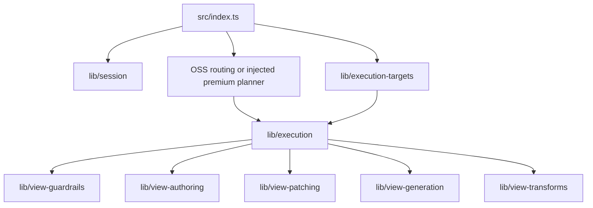

# `@continuum-dev/ai-engine` — source layout

**Navigate by folders first.** Each `lib/<area>/index.ts` is the contract for that area. The package entry is [`../index.ts`](../index.ts) (what consumers import).

## Public vs internal

| Exported from `src/index.ts` | Area |
|------------------------------|------|
| Yes | `session`, `execution`, `execution-targets`, `continuum-execution` (shared primitives + semantic identity), `view-guardrails`, `view-patching`, `view-authoring` (line-dsl + yaml + view-json + facade) |
| No (internal engines) | `view-generation`, `view-transforms` — used by `execution` / `patching` / `transforms` paths |

## `lib/*` capabilities

| Folder | Purpose |
|--------|---------|
| `session/` | `ContinuumSessionAdapter` port for apply and streaming. |
| `execution-targets/` | `catalog/`, `parser/`, `coercion/`; `types.ts` + `shared.ts` at area root. |
| `continuum-execution/` | Shared `.mjs` helpers (`shared.mjs`) and semantic identity normalization for custom planners; **not** the premium LLM planner (see `@continuum-cloud/ai-execution`). |
| `execution/` | Reference `streamContinuumExecution`, session apply/context; `session-api/`, `stream/`, `stream/phases/`, `stream/trace|preview|instruction/`. |
| `view-guardrails/` | `definition/`, `json/`, `normalize/`, `structure/`, `runtime-errors/`. |
| `view-patching/` | `truncate/`, `prompts/`, `normalize/`, `apply/`, `context/`, `detached-fields/`; `types.ts` at root. |
| `view-authoring/` | `line-dsl/`, `yaml/`, `view-json/` (structured ViewDefinition JSON); root `index.ts` picks `authoringFormat`. Shared Continuum layout, continuity, and collection rules live in `shared/continuum-view-authoring-guidance.ts` and are composed into each format’s system prompt (`view-json` appends them after `assembleSystemPrompt` + `VIEW_DEFINITION_OUTPUT_CONTRACT`). |
| `view-generation/` | Internal merge/apply pipeline: `normalize/`, `apply/`. |
| `view-transforms/` | Surgical transform planning (internal to execution flow). |

## Typical request flow

1. Host builds **context** (`buildContinuumExecutionContext` → `session`).
2. **OSS routing** (`resolve-oss-execution-plan`): default **view** generation, or explicit `executionMode` / `executionPlan` (precedence: plan > mode > default). **Premium** hosts inject **`streamContinuumExecution`** from `@continuum-cloud/ai-execution` for automatic planner-led routing.
3. **Execution** (`execution/stream`) runs **phases**: state, patch, transform, or full view.
4. View paths use **authoring**, **patching**, **guardrails**, **generation**, **transforms** as needed.
5. **Apply** (`applyContinuumExecutionFinalResult` → `session-api`) updates the session.

## Subpath `execution-stream`

[`../../execution-stream.ts`](../../execution-stream.ts) re-exports phase runners and stream environment construction for packages (for example **`@continuum-cloud/ai-execution`**) that implement premium planning while reusing OSS phase behavior.
