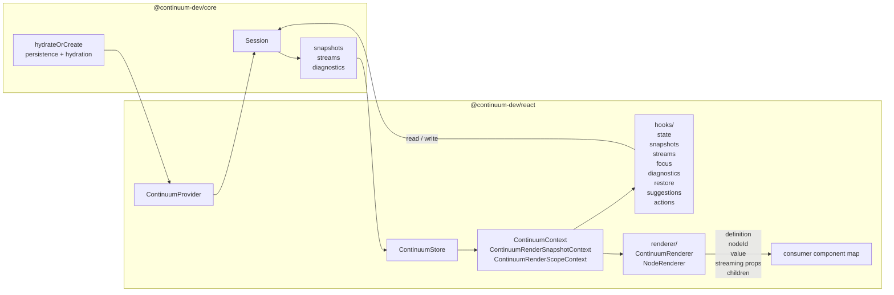

# @continuum-dev/react Deep Dive

This document is a comprehensive, implementation-level reference for the `@continuum-dev/react` library in `packages/react`.

It is designed for:

- Humans onboarding to this package
- AI agents that need accurate package semantics
- Reviewers validating behavior and extension safety

## Scope

This covers the important files and subsystems currently in `packages/react`:

- `README.md`
- `package.json`
- `tsconfig.json`
- `tsconfig.lib.json`
- `vitest.config.ts`
- `src/index.ts`
- `src/lib/types.ts`
- `src/lib/context/`
- `src/lib/hooks/`
- `src/lib/renderer/`
- `src/lib/fallback.tsx`
- `src/lib/error-boundary.tsx`
- `src/lib/context/index.spec.tsx`
- `src/lib/hooks/index.spec.tsx`
- `src/lib/hooks/shared.spec.ts`
- `src/lib/renderer/index.spec.tsx`
- `src/lib/renderer/integration.spec.tsx`
- `src/lib/fallback.spec.tsx`
- `src/lib/persistence.spec.tsx`

For source files, the major exported symbols and the highest-risk internal functions are documented.

## What This Library Does

`@continuum-dev/react` is the React binding layer for the Continuum SDK:

- Creates and owns a Continuum `Session` in React context
- Optionally hydrates/persists session data via browser storage
- Exposes React hooks that subscribe to session data and diagnostics
- Renders view-defined node trees via a node registry
- Contains safe fallbacks and error isolation for rendering failures

At a high level, it turns Continuum's session model into React-native primitives: provider, hooks, and renderer.

## Runtime Architecture

Main runtime flow:

1. `ContinuumProvider` resolves persistence settings and calls `hydrateOrCreate` from `@continuum-dev/core`.
2. Provider creates a `ContinuumStore` facade over session snapshot, stream, and diagnostics callbacks.
3. Provider publishes `{ session, store, componentMap, wasHydrated }` in `ContinuumContext`, plus render-time preview/scope contexts.
4. Hooks subscribe to specific store slices via `useSyncExternalStore` and call back into session mutations.
5. `ContinuumRenderer` walks `ViewDefinition.nodes`, computes canonical node ids, and resolves node components from your map.
6. Collection renderers create scoped node-state providers so item-local reads and writes map back to collection-backed values.
7. Stream metadata flows from session -> store -> hooks -> renderer so node components can receive build-state and stream-status props.
8. On provider unmount, session destruction is deferred with a zero-delay timer to avoid StrictMode replay hazards.

## Public API Surface

Export barrel: `src/index.ts`

- `types` exports
- `context` exports
- `hooks` exports
- `renderer` exports
- `error-boundary` exports
- `fallback` exports

Primary public symbols:

- `ContinuumProvider`
- `ContinuumContext`, `ContinuumContextValue`
- `ContinuumRenderSnapshotContext`, `ContinuumRenderScopeContext`
- `useContinuumSession`
- `useContinuumHydrated`
- `useContinuumState`
- `useContinuumSnapshot`
- `useContinuumCommittedSnapshot`
- `useContinuumStreams`, `useContinuumStreaming`
- `useContinuumFocus`
- `useContinuumDiagnostics`
- `useContinuumConflict`
- `useContinuumRestoreReviews`, `useContinuumRestoreCandidates`
- `useContinuumSuggestions`
- `useContinuumAction`
- `ContinuumRenderer`
- `NodeErrorBoundary`
- `FallbackComponent`
- Type exports from `types.ts`

## File-by-File Reference

## `package.json`

Role:

- Declares package metadata and dependency contract.

Important fields:

- `name`: `@continuum-dev/react`
- `type`: `module` (ESM)
- `main`: `./index.js`
- `types`: `./index.d.ts`
- `exports["."].@continuum-dev/source`: `./src/index.ts`
- `exports["."].import`: `./index.js`
- `peerDependencies.react`: `>=18`
- `dependencies`: `@continuum-dev/core`
- `nx.tags`: `scope:react`

Implications:

- React is required from consumer environment, not bundled as package dependency.
- Package exposes source entrypoint directly.

## `tsconfig.json`

Role:

- Thin project-level indirection to `tsconfig.lib.json`.

Details:

- `extends`: `./tsconfig.lib.json`
- Empty `compilerOptions` override
- No project references here

Implications:

- All significant TypeScript behavior is defined in `tsconfig.lib.json`.

## `tsconfig.lib.json`

Role:

- Build config for this library.

Important compiler options:

- `jsx: react-jsx`
- `rootDir: src`
- `outDir: ../../dist/packages/react`
- `types: ["node"]`
- `lib: ["es2022", "dom"]`

File set:

- Includes `.ts` and `.tsx` in `src`
- Excludes test files matching `*.spec.ts`, `*.test.ts`

Project references:

- `../core/tsconfig.lib.json`
- `../session/tsconfig.lib.json`
- `../contract/tsconfig.lib.json`

Implications:

- This library compiles against both Node and browser DOM APIs.
- It is tied to sibling Continuum packages via TS project references.

## `vitest.config.ts`

Role:

- Test runner configuration for this package.

Behavior:

- Uses Vite config wrapper (`defineConfig`)
- `environment: jsdom`
- Includes all `test/spec` JS/TS/JSX/TSX under `src`
- Coverage provider `v8`
- Coverage output: `./test-output/vitest/coverage`

Implications:

- Tests run with DOM emulation suitable for React rendering tests.

## `README.md`

Role:

- User-facing usage guide.

Content summary:

- Installation
- Quick start provider + renderer usage
- API summaries for provider, renderer, hooks
- Node map pattern
- Internal export notes

Relationship to this deep dive:

- README is usage-first.
- This document is implementation-first and architecture-focused.

## `src/index.ts`

Role:

- Public export barrel.

Statements:

- `export * from './lib/types.js';`
- `export * from './lib/context/index.js';`
- `export * from './lib/hooks/index.js';`
- `export * from './lib/renderer/index.js';`
- `export * from './lib/error-boundary.js';`
- `export * from './lib/fallback.js';`

Implications:

- All symbols in listed modules become package API by default.
- Any accidental export added in those files becomes externally visible unless restricted.

## `src/lib/types.ts`

Role:

- Shared React and provider type contracts.

### `interface ContinuumNodeProps<T = NodeValue>`

Purpose:

- Standard prop contract for view-rendered nodes.

Fields:

- `value: T | undefined`: current node value
- `hasSuggestion?: boolean`: whether the current node has a suggestion payload
- `suggestionValue?: unknown`: current suggestion payload when present
- `onChange: (value: T) => void`: state update callback
- `definition: ViewNode`: view metadata for this node
- `nodeId?: string`: canonical scoped node id
- `isStreaming?: boolean`: whether this node/subtree is actively streaming
- `buildState?: 'building' | 'ready' | 'committed' | 'error'`: renderer-facing build state
- `streamStatus?: ContinuumNodeStreamStatus`: node-specific streaming metadata
- `children?: React.ReactNode`: rendered child nodes for nested nodes
- `[prop: string]: unknown`: forward-compatible slot for view-provided props

Usage:

- Consumed by library renderer and by consumer node implementations.

### `type ContinuumNodeMap`

Definition:

- `Record<string, ComponentType<ContinuumNodeProps<any>>>`

Purpose:

- Registry mapping view `definition.type` strings to React components.

Resolution behavior (implemented in `renderer/node-renderers.tsx`):

- First try exact type key.
- Then try `'default'`.
- Then use `FallbackComponent`.

### `interface ContinuumProviderProps`

Purpose:

- Props accepted by `ContinuumProvider`.

Fields:

- `components`: node registry (required)
- `persist`: `'sessionStorage' | 'localStorage' | false` (optional)
- `storageKey`: custom storage key (optional)
- `maxPersistBytes`: persistence payload size guard (optional)
- `onPersistError`: persistence error callback (optional)
- `sessionOptions`: options forwarded to `hydrateOrCreate` (optional)
- `children`: React subtree (required)

## `src/lib/context/`

Role:

- Store, root contexts, and provider lifecycle for the React binding.

Submodules:

- `store.ts`: subscription-oriented facade over session snapshot, stream, diagnostics, and node events
- `render-contexts.ts`: public React contexts and `ContinuumContextValue`
- `provider.tsx`: hydration, persistence wiring, stable component-map handling, and teardown

### `interface ContinuumStore`

Purpose:

- Gives hooks and renderer code a stable subscription/read API over the underlying session.

Key methods:

- `getSnapshot()`, `getCommittedSnapshot()`
- `getStreams()`, `getActiveStream()`
- `subscribeSnapshot()`, `subscribeStreams()`, `subscribeDiagnostics()`, `subscribeNode()`
- `getNodeValue()`, `getFocusedNodeId()`
- `destroy()`

### `createContinuumStore(session): ContinuumStore`

Behavior:

1. Cache current snapshot, committed snapshot, and stream list.
2. Fan out `session.onSnapshot` into:
   - snapshot listeners
   - diagnostics listeners
   - only the node listeners whose values changed, plus node listeners for the previous and next focused ids when focus changes
3. Fan out `session.onStreams` into stream listeners.
4. Fan out `session.onIssues` into diagnostics listeners.
5. Expose stable getters and subscription helpers for the rest of the library.

### `interface ContinuumContextValue`

Fields:

- `session: Session`
- `store: ContinuumStore`
- `componentMap: ContinuumNodeMap`
- `wasHydrated: boolean`

### `const ContinuumContext = createContext<ContinuumContextValue | null>(null)`

Purpose:

- React context for all hooks and renderer internals.

Default value:

- `null`, so hooks can detect missing provider and throw explicit errors.

### `resolveStorage(persist): Storage | undefined`

Type:

- Internal helper function.

Input:

- `persist` from provider props.

Behavior:

- `false`/falsy -> `undefined`
- `'sessionStorage'` -> `globalThis.sessionStorage`
- `'localStorage'` -> `globalThis.localStorage`
- any other value -> `undefined`

Notes:

- Assumes browser-like environment where `globalThis.*Storage` exists.

### `hydrateOrCreate(options?): Session`

Type:

- Imported session factory helper from `@continuum-dev/core`.

Behavior:

1. If persistence options include storage, it attempts hydration from storage key.
2. If deserialization fails, it clears the invalid entry and creates a fresh session.
3. Without persistence options, it creates a fresh session directly.

Design intent:

- Prefer recovery and forward progress over fatal hydration errors.

### `ContinuumProvider(props)`

Type:

- Exported React function component.

Responsibility:

- Own one session instance for the provider lifetime, expose it via context, and synchronize persistence/destruction behavior.

Detailed lifecycle behavior:

1. Resolve persistence storage with `resolveStorage`.
2. Use `sessionRef` to lazily initialize session exactly once per mount cycle:
   - Hydrate from storage if possible
   - Otherwise create new session
3. Create one `ContinuumStore` alongside that session.
4. Read stable `session`, `store`, and `wasHydrated` from ref.
5. Manage destruction with an unmount cleanup timer:
   - On mount/effect rerun, clear any previous pending destroy timer
   - On cleanup, schedule `store.destroy()` and `session.destroy()` in `setTimeout(..., 0)`
   - Then clear timer ref
6. Memoize context value from `session`, `store`, `componentMap`, `wasHydrated`.
7. Render `<ContinuumContext.Provider value={value}>{children}</ContinuumContext.Provider>`.

Why delayed destroy matters:

- React StrictMode can mount/unmount/replay trees during development.
- Zero-delay deferred destroy prevents immediate teardown that could break replay timing.

Potential edge cases:

- If storage APIs are unavailable in current runtime, direct `globalThis.localStorage/sessionStorage` access can throw before provider completes.
- `componentMap` identity changes trigger new memoized context object, causing downstream re-renders.

## `src/lib/hooks/`

Role:

- React hooks binding session/store state to external-store subscriptions.

Submodules:

- `provider.ts`: provider-bound accessors (`useRequiredContinuumContext`, `useContinuumSession`, `useContinuumHydrated`)
- `state.ts`: canonical node-value subscriptions (`useContinuumState`)
- `snapshots.ts`: current and committed snapshot hooks
- `streams.ts`: raw stream-list hook and foreground streaming summary hook
- `focus.ts`: focus subscriptions (`useContinuumFocus`)
- `diagnostics.ts`: diagnostics and conflict hooks
- `restore.ts`: detached restore review and candidate hooks
- `suggestions.ts`: bulk suggestion state/actions
- `actions.ts`: action dispatch state
- `shared.ts`: equality helpers used to stabilize hook return identity

Key design rule:

- Subscription-based hooks read through `ContinuumStore` with `useSyncExternalStore`; they do not subscribe to session callbacks directly.

### `useContinuumSession(): Session`

Behavior:

- Reads `ContinuumContext`, throws if absent, and returns `ctx.session`.

### `useContinuumHydrated(): boolean`

Behavior:

- Reads `ContinuumContext`, throws if absent, and returns `ctx.wasHydrated`.

### `useContinuumState(nodeId): [NodeValue | undefined, (value) => void]`

Behavior:

1. Resolve `{ session, store }` from context.
2. Optionally resolve `NodeStateScopeContext` when rendering inside collection item scopes.
3. Subscribe with either `scope.subscribeNode(nodeId, ...)` or `store.subscribeNode(nodeId, ...)`.
4. Cache and shallow-compare the selected `NodeValue` to preserve stable identity when fields have not changed.
5. Write through either `scope.setNodeValue(...)` or `session.updateState(nodeId, next)`.

### `useContinuumSnapshot()` and `useContinuumCommittedSnapshot()`

Behavior:

- Subscribe to snapshot changes through `store.subscribeSnapshot(...)`.
- Reuse cached snapshot objects when `view` and `data` references are unchanged.
- `useContinuumCommittedSnapshot()` reads the committed snapshot lane instead of the live one.

### `useContinuumStreams()` and `useContinuumStreaming()`

Behavior:

- `useContinuumStreams()` returns the raw stream metadata array from the store.
- `useContinuumStreaming()` derives `{ streams, activeStream, isStreaming }` for the active foreground stream.

### `useContinuumFocus(nodeId)`

Behavior:

- Subscribes through `store.subscribeNode(nodeId, ...)` and `session.onFocusChange` so the hook updates when this node's focus boolean changes or when snapshot-driven node subscriptions fire.
- Returns `[isFocused, setFocused]` where `setFocused(true)` calls `session.setFocusedNodeId(nodeId)` and `setFocused(false)` clears focus when this node is currently focused.
- Session revalidates focus against the active render tree after pushed and streamed view changes, so this hook also updates when a focused node moves or disappears.
- Logs a development warning if called inside a collection item scope, because focus is not supported for collection item nodes.

### `useContinuumDiagnostics()` and `useContinuumConflict(nodeId)`

Behavior:

- `useContinuumDiagnostics()` subscribes to the store's diagnostics channel and returns `{ issues, diffs, resolutions, checkpoints }`.
- `useContinuumConflict(nodeId)` subscribes to the pending proposal for one node and returns `{ hasConflict, proposal, accept, reject }`.

### `useContinuumRestoreReviews()` and `useContinuumRestoreCandidates(nodeId)`

Behavior:

- `useContinuumRestoreReviews()` returns all pending detached restore reviews.
- `useContinuumRestoreCandidates(nodeId)` filters those reviews by the current render scope and node id.
- Both hooks preserve empty-array identity through shared sentinel arrays.

### `useContinuumSuggestions()`

Behavior:

- Scans current snapshot values for node suggestions.
- Returns `hasSuggestions` plus bulk `acceptAll()` / `rejectAll()` actions that call back into `session.updateState(...)`.

### `useContinuumAction(intentId)`

Behavior:

- Wraps `session.dispatchAction(intentId, nodeId)`.
- Tracks `isDispatching` and `lastResult`.
- Ignores stale completions when multiple dispatches overlap.

## `src/lib/renderer/`

Role:

- View-driven React renderer split into path helpers, streaming derivation, collection-state helpers, recursive node renderers, and the public root renderer.

Submodules:

- `paths.ts`: canonical id and scope helpers
- `streaming.ts`: stream-status lookup and node build-state derivation
- `collection-state.ts`: collection normalization, defaults, and suggestion merging helpers
- `node-renderers.tsx`: `StatefulNodeRenderer`, `ContainerNodeRenderer`, `CollectionItemRenderer`, `CollectionNodeRenderer`, and `NodeRenderer`
- `root.tsx`: exported `ContinuumRenderer`

### `NodeRenderer({ definition, parentPath })`

Type:

- Internal recursive component.

Behavior:

1. If `definition.type === 'collection'`, render `CollectionNodeRenderer`.
2. Otherwise inspect `getChildNodes(definition)`:
   - child nodes present -> `ContainerNodeRenderer`
   - no child nodes -> `StatefulNodeRenderer`
3. Compute canonical node ids from `parentPath` via `toCanonicalId(...)`.
4. Resolve node components by exact type, then `default`, then `FallbackComponent`.
5. Wrap each rendered node with `NodeErrorBoundary`.

Important semantics:

- Hidden definitions render `null`.
- Per-node error boundary isolates render failures by node id.
- There is no generic wrapper div around every node.
- Container and collection renderers pass additional mapped props like `itemIndex`, `canRemove`, `onRemove`, `canAdd`, and `onAdd`.

### `ContinuumRenderer({ view, snapshotOverride, renderScope })`

Type:

- Exported function component.

Behavior:

- Accepts the current `view` plus optional preview-only `snapshotOverride` and `renderScope`.
- Provides `ContinuumRenderSnapshotContext` and `ContinuumRenderScopeContext`.
- When a snapshot override is present, creates a root `NodeStateScopeContext` that reads from the override snapshot instead of the live store.
- Renders `(view.nodes ?? [])` as top-level `NodeRenderer`s.

## `src/lib/fallback.tsx`

Role:

- Built-in fallback UI for unknown node types.

### `FallbackComponent({ value, onChange, definition })`

Type:

- Exported function component.

Behavior:

1. Coerce incoming `value` to `NodeValue | undefined`.
2. Derive text input value:
   - if `raw.value` is string or number, use `String(raw.value)`
   - else empty string
3. Derive display labels:
   - `displayName = definition.label ?? definition.id`
   - `placeholder = definition.placeholder ?? \`Enter value for "${displayName}"\``
4. Render warning UI with red-dashed visual style.
5. Render `<input>`:
   - Controlled by `textValue`
   - On change, calls `onChange({ value: e.target.value } as NodeValue)`
6. Render `
` block with pretty-printed full view `definition`.

Purpose:

- Makes unsupported view node types visible and editable rather than silently failing.
- Provides diagnostic visibility by showing raw definition JSON.

## `src/lib/error-boundary.tsx`

Role:

- Per-node render error isolation.

### `interface NodeErrorBoundaryProps`

Fields:

- `nodeId: string`
- `children: ReactNode`

### `interface NodeErrorBoundaryState`

Fields:

- `hasError: boolean`
- `message: string`

### `class NodeErrorBoundary extends Component<Props, State>`

Exported class component with two methods:

#### `static getDerivedStateFromError(error): NodeErrorBoundaryState`

Behavior:

- Converts any thrown render error into boundary state:
  - `hasError: true`
  - `message`: `error.message` if `Error`, else `String(error)`

#### `render()`

Behavior:

- If `hasError`, render:
  - `
`
  - text: `Node render failed: {nodeId} ({message})`
- Otherwise return normal `children`.

Scope:

- Boundary catches rendering/lifecycle errors in subtree node rendering phase.

## `src/lib/fallback.spec.tsx`

Role:

- Unit-level sanity check for fallback component return shape.

Test suite: `describe('FallbackComponent', ...)`

### Test: "returns a renderable React element for unknown node types"

Asserts:

- Calling `FallbackComponent(...)` returns a defined React element.
- Root element type is `div`.
- Element has children.
- Placeholder prop on input child equals provided placeholder.

What this protects:

- Base renderability and expected prop plumbing for unknown type fallback path.

## `src/lib/renderer/integration.spec.tsx`

Role:

- End-to-end integration tests across provider, hooks, renderer, hydration, diagnostics, and lifecycle.

Supporting definitions:

- `view`: simple one-node view fixture
- `componentMap`: field + default node fixtures
- global test flag: `IS_REACT_ACT_ENVIRONMENT = true`

### Helper function: `renderIntoDom(element)`

Purpose:

- Mounts React element into a real `document` container using `createRoot` and `act`.

Returns:

- `container` (DOM node)
- `unmount()` helper that calls `root.unmount()` inside `act` and removes container

### Test: "throws when session hook is used outside provider"

Verifies:

- `useContinuumSession` enforces provider boundary with thrown error.

### Test: "hydrates from localStorage and reports hydrated=true"

Setup:

- Create seed session
- Push view and state
- Serialize to `localStorage` at default key

Verifies:

- Provider with `persist="localStorage"` hydrates data
- `useContinuumHydrated()` returns `true`
- Snapshot contains stored node value

### Test: "supports state updates through useContinuumState"

Verifies:

- Hook setter updates session state
- UI reflects update (`button.textContent` becomes `next`)

### Test: "renders views and tolerates null node arrays"

Verifies:

- Renderer does not crash when `view.nodes` is `null`.
- Root view data attribute is rendered.

### Test: "does not render nodes marked hidden"

Verifies:

- Node with `hidden: true` is not rendered into DOM.

### Test: "forwards definition to rendered component"

Verifies:

- `definition` reaches node implementation.

### Test: "isolates node render errors with per-node boundary"

Verifies:

- Throwing node shows per-id error boundary output.
- Sibling nodes continue rendering.

### Test: "exposes diagnostics and destroys session on unmount"

Setup:

- `vi.useFakeTimers()` to control deferred destroy.

Verifies:

- Diagnostics hook returns arrays with expected non-negative lengths.
- After unmount and timer flush, session snapshot becomes `null` (destroyed).

### Test: "keeps session usable in StrictMode replay"

Verifies:

- Provider/session remains functional under `StrictMode` mount/replay behavior.
- State updates continue to work.

## Internal Behavior Notes and Contracts

## Session Ownership Contract

- A provider owns one session instance through its mount lifecycle.
- Session creation is lazy and ref-backed, not state-backed.
- Destroy is deferred to avoid premature disposal during StrictMode replay.

## Persistence Contract

- Storage hydration is best effort.
- Corrupt storage is deleted automatically.
- Persistence behavior is delegated to the `@continuum-dev/core` session layer.
- Storage failures are surfaced through the configured persistence error callback.

## Rendering Contract

- Hidden definitions render as `null`.
- Unknown type resolution: specific type -> `default` -> `FallbackComponent`.
- Every rendered node is wrapped with a per-node error boundary.
- Canonical `nodeId` values are passed through props rather than through a wrapper DOM marker.

## Hook Safety Contract

- Hooks requiring provider throw clear errors when outside provider.
- Store subscriptions are created via `useSyncExternalStore` to align with React external-store guarantees.

## Dependency and Integration Map

Direct package dependencies:

- `@continuum-dev/core`: runtime/session/contract facade consumed by this package
- `react`: runtime peer dependency

Workspace TypeScript references:

- `@continuum-dev/core`
- `@continuum-dev/session`
- `@continuum-dev/contract`

Inferred runtime dependency graph:

- `context/provider.tsx`, `context/store.ts`, and `context/render-contexts.ts` depend on `@continuum-dev/core` and `types.ts`
- `hooks/provider.ts`, `hooks/state.ts`, and related hook modules depend on the `context/` subsystem and session API
- `renderer/root.tsx` and `renderer/node-renderers.tsx` depend on the `context/` subsystem, the `hooks/` subsystem, fallback + error boundary
- `fallback.tsx` depends on `types.ts`
- tests exercise integrated surface across all runtime modules

## Known Tradeoffs and Extension Guidance

Current tradeoffs:

- Silent persistence errors favor availability over observability.
- `definition` is provided directly and is easier to reason about than blind spread.
- Storage access assumes browser globals.

Safe extension points:

- Add new hooks in `hooks/` using the same `useSyncExternalStore` pattern.
- Add renderer behavior by extending `NodeRenderer` resolution and wrappers.
- Replace fallback style/behavior in `FallbackComponent` without changing API.

Change-risk hot spots:

- Provider lifecycle (`context/provider.tsx`) because hydration, persistence, and destroy timing intersect there.
- Hook caching logic (`useContinuumSnapshot`, `useContinuumDiagnostics`) because identity stability affects render frequency.
- Recursive rendering (`NodeRenderer`) because prop spread and error boundaries affect all node types.

## Testing and Verification Commands

Use Nx tasks for this package:

- `nx test @continuum-dev/react`
- `nx build @continuum-dev/react`
- `npx nx run "@continuum-dev/react:test" --excludeTaskDependencies`
- `npx nx run "@continuum-dev/react:build"`

Project metadata:

- project: `@continuum-dev/react`
- type: `library`
- root: `packages/react`
- tags: `scope:react`
- explicit target in `project.json`: `nx-release-publish`
- build/test targets are inferred by workspace tooling

## Quick Index of Functions and Methods

For fast AI/human lookup, this is the high-value function index across source and key specs:

- `resolveStorage` (`context/provider.tsx`)
- `createContinuumStore` (`context/store.ts`)
- `ContinuumProvider` (`context/provider.tsx`)
- `useRequiredContinuumContext` (`hooks/provider.ts`)
- `shallowArrayEqual` (`hooks/shared.ts`)
- `useContinuumSession` (`hooks/provider.ts`)
- `useContinuumHydrated` (`hooks/provider.ts`)
- `useContinuumState` (`hooks/state.ts`)
- `useContinuumSnapshot` (`hooks/snapshots.ts`)
- `useContinuumCommittedSnapshot` (`hooks/snapshots.ts`)
- `useContinuumStreams` (`hooks/streams.ts`)
- `useContinuumStreaming` (`hooks/streams.ts`)
- `useContinuumFocus` (`hooks/focus.ts`)
- `useContinuumDiagnostics` (`hooks/diagnostics.ts`)
- `useContinuumConflict` (`hooks/diagnostics.ts`)
- `useContinuumRestoreReviews` (`hooks/restore.ts`)
- `useContinuumRestoreCandidates` (`hooks/restore.ts`)
- `useContinuumSuggestions` (`hooks/suggestions.ts`)
- `useContinuumAction` (`hooks/actions.ts`)
- `toCanonicalId` (`renderer/paths.ts`)
- `resolveStreamStatus` (`renderer/streaming.ts`)
- `deriveNodeBuildState` (`renderer/streaming.ts`)
- `normalizeCollectionNodeValue` (`renderer/collection-state.ts`)
- `NodeRenderer` (`renderer/node-renderers.tsx`)
- `ContinuumRenderer` (`renderer/root.tsx`)
- `FallbackComponent` (`fallback.tsx`)
- `NodeErrorBoundary.getDerivedStateFromError` (`error-boundary.tsx`)
- `NodeErrorBoundary.render` (`error-boundary.tsx`)
- `renderIntoDom` (`renderer/integration.spec.tsx`)

---

If this package grows, update this file whenever a new source file, exported symbol, or hook/renderer lifecycle behavior is added.
