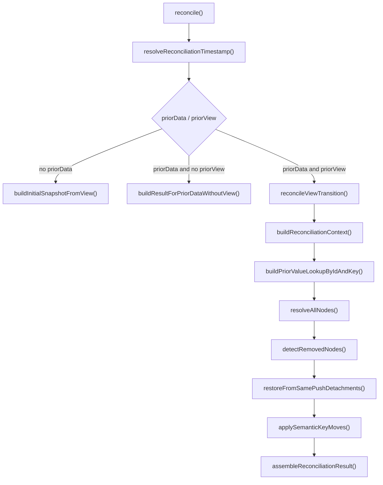

# `@continuum-dev/runtime` Comprehensive Reference

This document is the package-level companion to [README.md](./README.md).

Use it when you need a more technical view of the runtime package without diving immediately into every subsystem file. The top-level README explains the package for adopters. This file summarizes the current contract, architecture, and source-of-truth docs that back it.

## Package Purpose

`@continuum-dev/runtime` is a deterministic reconciliation engine for AI-generated view transitions.

It exists to close the **Ephemerality Gap**: the mismatch between regenerating UI structure and durable user intent.

At a high level, the package turns:

- `newView`
- `priorView`
- `priorData`
- `options`

into:

- `reconciledState`
- `diffs`
- `issues`
- `resolutions`

The reconciliation core is pure and side-effect free. For identical inputs and the same resolved timestamp source, it produces the same result.

## Package Surface

### Published exports

The package publishes:

- root: `@continuum-dev/runtime` — `reconcile`, `applyContinuumViewUpdate`, `applyContinuumNodeValueWrite`, `decideContinuumNodeValueWrite`, shared protocol constants, core reconciliation types, and boundary input/output types for the root entrypoints
- subpaths: `@continuum-dev/runtime/validator`, `node-lookup`, `canonical-snapshot`, `value-write`, `view-stream`, `restore-candidates`

View patch mechanics under `src/lib/view-patch` are internal implementation; consumers use `applyContinuumViewUpdate` or `applyContinuumViewStreamPart` (via the `view-stream` subpath) so work always re-enters reconcile-backed paths.

The validator subpath re-exports the validator boundary from `src/validator.ts`.

### Root entry

Public barrel:

- `src/index.ts`

Current root exports are explicit re-exports from:

- `./lib/reconcile/index.js`
- `./lib/runtime-boundaries/view-updates.js` (via `applyContinuumViewUpdate` and its boundary types)
- `./lib/runtime-boundaries/direct-updates.js` (value write entrypoints and their boundary types)
- `./lib/types.js` (shared protocol constants plus curated reconcile types)

### Supported reconcile entrypoint

Supported runtime entrypoint:

- `src/lib/reconcile/index.ts`

```typescript
function reconcile(input: ReconcileInput): ReconciliationResult;
```

## Public Contract Summary

### `ReconciliationResult`

```typescript
interface ReconciliationResult {
  reconciledState: DataSnapshot;
  diffs: StateDiff[];
  issues: ReconciliationIssue[];
  resolutions: ReconciliationResolution[];
}
```

### `ReconciliationOptions`

```typescript
interface ReconciliationOptions {
  allowPartialRestore?: boolean;
  allowPriorDataWithoutPriorView?: boolean;
  migrationStrategies?: Record<string, MigrationStrategy>;
  strategyRegistry?: Record<string, MigrationStrategy>;
  clock?: () => number;
}
```

### `ReconciliationResolution`

```typescript
interface ReconciliationResolution {
  nodeId: string;
  priorId: string | null;
  matchedBy: 'id' | 'semanticKey' | 'key' | null;
  priorType: string | null;
  newType: string;
  resolution: DataResolution;
  priorValue: unknown;
  reconciledValue: unknown;
}
```

### `MigrationStrategy`

The exported `MigrationStrategy` is context-shaped:

- `({ nodeId, priorNode, newNode, priorValue }) => unknown`

## Runtime Branch Model

`reconcile()` always resolves time first, then takes exactly one branch.

### Initial snapshot (no prior data)

Condition:

- `priorData === null`

Behavior:

- builds an initial snapshot from the new view
- initializes defaults where appropriate
- emits added outcomes
- requires `options.clock`

### Prior data without prior view

Condition:

- `priorData !== null`
- `priorView === null`

Behavior:

- emits `NO_PRIOR_VIEW`
- copies prior values by exact scoped node id only when `allowPriorDataWithoutPriorView` is enabled
- does not attempt key or semantic-key matching

### Full transition

Condition:

- `priorData !== null`
- `priorView !== null`

Behavior:

- builds context indexes
- remaps prior values into new-view-relevant lookup space
- resolves every new node
- detects removed nodes
- applies same-push restore and semantic-key move post-processing
- assembles the final snapshot

## Matching And Safety Model

In full transition reconciliation, match precedence is fixed:

1. scoped `id`
2. unique `semanticKey`
3. scoped `key`

Important consequences:

- matching is deterministic and path-aware
- semantic-key matching is disabled when uniqueness is ambiguous
- unsafe carry is blocked by detaching the prior value instead of forcing it into the new node
- detached values can later be restored when compatible structure reappears

## Core Terms

### Detached values

`detachedValues` stores values that should not remain active but also should not be discarded.

Common causes:

- node removal
- type mismatch

Detached values are later eligible for restoration when a compatible node returns.

### Carry

A value continues forward without transformation.

### Migrate

A value is deliberately transformed because the node contract changed and a migration route exists.

### Restore

A previously detached value becomes active again in the new snapshot.

### Issues

Structured warnings, errors, or info emitted during reconciliation and validation.

## Reconciliation Pipeline

The full transition path is stage-based and deterministic.



## Internal Module Map

The runtime is organized into a few clear layers.

| Area                                 | Responsibility                                                           | Primary doc                                                                                                      |
| ------------------------------------ | ------------------------------------------------------------------------ | ---------------------------------------------------------------------------------------------------------------- |
| `reconcile`                          | entrypoint, branching, time resolution, post-resolution transforms       | [`src/lib/reconcile/README.md`](./src/lib/reconcile/README.md)                                                   |
| `context`                            | scoped indexing, duplicate issues, match helpers, prior-value projection | [`src/lib/context/README.md`](./src/lib/context/README.md)                                                       |
| `reconciliation/node-resolver`       | per-node resolution and removed-node detection                           | [`src/lib/reconciliation/node-resolver/README.md`](./src/lib/reconciliation/node-resolver/README.md)             |
| `reconciliation/collection-resolver` | collection normalization, remap, migration, constraints                  | [`src/lib/reconciliation/collection-resolver/README.md`](./src/lib/reconciliation/collection-resolver/README.md) |
| `reconciliation/migrator`            | strategy selection and deterministic migration execution                 | [`src/lib/reconciliation/migrator/README.md`](./src/lib/reconciliation/migrator/README.md)                       |
| `reconciliation/differ`              | canonical diff and resolution factories                                  | [`src/lib/reconciliation/differ/README.md`](./src/lib/reconciliation/differ/README.md)                           |
| `reconciliation/result-builder`      | fresh/blind result builders, final assembly, lineage merge               | [`src/lib/reconciliation/result-builder/README.md`](./src/lib/reconciliation/result-builder/README.md)           |
| `reconciliation/view-traversal`      | deterministic DFS traversal and structural traversal issues              | [`src/lib/reconciliation/view-traversal/README.md`](./src/lib/reconciliation/view-traversal/README.md)           |
| `validator`                          | constraint validation and issue emission                                 | [`src/lib/validator/README.md`](./src/lib/validator/README.md)                                                   |
| `view-patch`                         | internal patch application helpers used behind runtime structural flows  | `src/lib/view-patch/index.ts`                                                                                    |

## What Is Stable vs Internal

Safe to rely on from package docs:

- the package export map
- the supported `reconcile()` entrypoint
- the top-level result shape
- the three-branch execution model
- documented matching precedence and detached-value safety behavior
- validator exports and the documented runtime subpaths exposed through the package surface

Do not treat as stable public API just because source files exist:

- deep imports into internal runtime modules
- internal helper names and file layout
- incidental ordering details not explicitly documented as guarantees

## Behavioral Source Of Truth

For behavior statements, these docs are the source of truth:

- [`src/lib/reconcile/behavior-guarantees.md`](./src/lib/reconcile/behavior-guarantees.md)
- [`src/lib/reconcile/README.md`](./src/lib/reconcile/README.md)
- [`src/lib/context/README.md`](./src/lib/context/README.md)
- [`src/lib/reconciliation/README.md`](./src/lib/reconciliation/README.md)
- [`src/lib/reconciliation/node-resolver/README.md`](./src/lib/reconciliation/node-resolver/README.md)
- [`src/lib/reconcile/semantic-moves/README.md`](./src/lib/reconcile/semantic-moves/README.md)
- [`src/lib/reconciliation/collection-resolver/README.md`](./src/lib/reconciliation/collection-resolver/README.md)
- [`src/lib/reconciliation/result-builder/README.md`](./src/lib/reconciliation/result-builder/README.md)
- [`src/lib/reconciliation/differ/README.md`](./src/lib/reconciliation/differ/README.md)
- [`src/lib/reconciliation/migrator/README.md`](./src/lib/reconciliation/migrator/README.md)
- [`src/lib/reconciliation/view-traversal/README.md`](./src/lib/reconciliation/view-traversal/README.md)
- [`src/lib/validator/README.md`](./src/lib/validator/README.md)

## Test Anchors

Primary integration and behavior-locking specs include:

- `src/lib/reconcile/core.spec.ts`
- `src/lib/reconcile/hardening.spec.ts`
- `src/lib/reconcile/semantic-key.spec.ts`
- `src/lib/reconcile/stress.spec.ts`
- `src/lib/context/context.spec.ts`
- `src/lib/context/matching.spec.ts`
- `src/lib/reconciliation/node-resolver/node-resolver.spec.ts`
- `src/lib/reconciliation/collection-resolver/collection-resolver.spec.ts`
- `src/lib/reconciliation/result-builder/result-builder.spec.ts`
- `src/lib/validator/validator.spec.ts`

## Practical Read Order

Recommended order for maintainers:

1. [README.md](./README.md)
2. [`src/lib/types.ts`](./src/lib/types.ts)
3. [`src/lib/reconcile/README.md`](./src/lib/reconcile/README.md)
4. [`src/lib/context/README.md`](./src/lib/context/README.md)
5. [`src/lib/reconciliation/README.md`](./src/lib/reconciliation/README.md)
6. [`src/lib/reconciliation/node-resolver/README.md`](./src/lib/reconciliation/node-resolver/README.md)
7. [`src/lib/reconciliation/collection-resolver/README.md`](./src/lib/reconciliation/collection-resolver/README.md)
8. [`src/lib/reconciliation/result-builder/README.md`](./src/lib/reconciliation/result-builder/README.md)
9. relevant specs

## Maintenance Rule

This file should stay aligned with:

- the actual package exports in `package.json`
- the current runtime entrypoints in `src/index.ts` and `src/lib/reconcile/index.ts`
- the behavioral subsystem READMEs listed above

If those change, update this document in the same change so package-level docs remain trustworthy.
