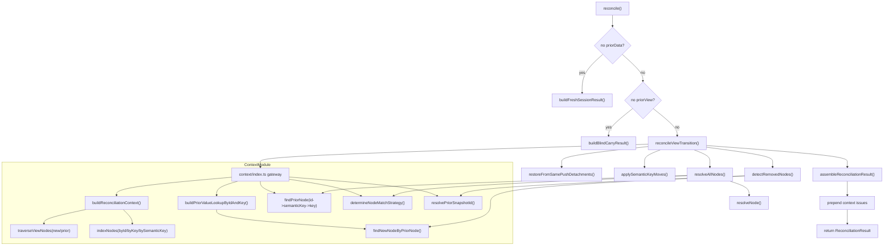

# Runtime Context Module

This module builds and queries the reconciliation context used by the runtime pipeline.

It answers three core questions deterministically:

- How are nodes indexed in `newView` and `priorView`?
- Which prior node matches a new node (and why)?
- How should prior snapshot values be projected into the new view ID space?

## Where Context Fits

`reconcile()` routes to `reconcileViewTransition()` when both `priorView` and `priorData` exist.

Inside that transition path, context APIs are used in this order:

1. `buildReconciliationContext()`
2. `buildPriorValueLookupByIdAndKey()`
3. `findPriorNode()` and `determineNodeMatchStrategy()` during node resolution
4. `resolvePriorSnapshotId()` and `findNewNodeByPriorNode()` during removed-node detection

`collectDuplicateIssues()` is also used by fresh/blind result builders.

## Public Gateway API

Gateway file: `packages/runtime/src/lib/context/index.ts`

### `buildReconciliationContext(newView, priorView)`

Builds `ReconciliationContext`, including:

- `newById`, `priorById` using scoped IDs
- `newByKey`, `priorByKey` using scoped keys
- `newBySemanticKey`, `priorBySemanticKey` only for semantic keys unique within each side
- `newNodeIds`, `priorNodeIds` weak maps for node object to scoped ID lookup
- `newSemanticKeyCounts`, `priorSemanticKeyCounts`
- aggregated indexing/traversal issues

### `collectDuplicateIssues(nodes)`

Scans one view for:

- duplicate scoped node IDs (`DUPLICATE_NODE_ID`)
- duplicate scoped keys (`DUPLICATE_NODE_KEY`)
- ambiguous semantic keys (`SCOPE_COLLISION`)
- traversal issues from `traverseViewNodes` (for example cycle/depth checks)

### `findPriorNode(ctx, newNode)`

Returns the best prior node match with strict precedence:

1. scoped ID
2. semantic key (only when unique in both views)
3. scoped key

### `determineNodeMatchStrategy(ctx, newNode, priorNode)`

Returns how the provided pair matched: `'id' | 'semanticKey' | 'key' | null`.

### `findNewNodeByPriorNode(ctx, priorNode)`

Forward-maps a prior node to new view using:

1. semantic key (unique on both sides)
2. scoped key

### `buildPriorValueLookupByIdAndKey(priorData, ctx)`

Builds a lookup map of prior values keyed by new-view-relevant IDs.

For each prior `(id, value)`:

- if `id` already exists in `ctx.newById`, copy directly
- if prior node exists and maps forward via `findNewNodeByPriorNode`, also set by new scoped ID

### `resolvePriorSnapshotId(ctx, priorId)`

Returns `priorId` when it exists in `ctx.priorById`; otherwise `null`.

### `ReconciliationContext`

Precomputed indexing and matching state used by node resolution, removal detection, and carry logic.

## Core Model and Scoping Rules

### Scoped IDs

Traversal produces scoped IDs based on parent path:

- root field: `email`
- nested field: `billing/email`

Matching and indexing operate on scoped IDs, not raw `node.id` alone.

### Scoped Keys

Keys are scoped to parent path with `toIndexedKey`/`toScopedKey`:

- root key `name` -> `name`
- nested key under `shipping` -> `shipping/name`

This prevents cross-parent key collisions from being treated as duplicates.

### Semantic Key Uniqueness Gate

Semantic-key matching is enabled only when the semantic key count is exactly `1` in both views.

If not unique, context emits `SCOPE_COLLISION` and semantic-key maps do not index that key.

## Determinism Contract

This module is deterministic for fixed input views and snapshot data.

- Matching precedence is fixed and non-heuristic.
- Lookups are exact `Map`/`WeakMap` operations.
- No fuzzy scoring, randomization, or probabilistic ranking.
- Duplicate overwrite behavior is stable by traversal order (`Map#set` on repeat keys).
- Issue ordering follows traversal order and call-site composition.

## Internal Phase Breakdown

### 1) Indexing Phase (`indexing.ts`)

- Traverse new/prior views with `traverseViewNodes`.
- Count semantic keys per side.
- Index IDs/keys and conditionally semantic keys.
- Collect duplicate and ambiguity issues during indexing.

### 2) Matching Phase (`matching.ts`)

- New to prior:
  - `findPriorNode`: `id -> semanticKey -> key`
- Prior to new:
  - `findNewNodeByPriorNode`: `semanticKey -> key`

### 3) Snapshot Projection (`snapshot-values.ts`)

- Project prior values into a lookup keyed for new resolution.
- Supports direct ID carry and forward-mapped carry paths.

## Issue Model

Context-related issue categories include:

- `DUPLICATE_NODE_ID`
- `DUPLICATE_NODE_KEY`
- `SCOPE_COLLISION`
- traversal issues from `view-traversal`:
  - `VIEW_CHILD_CYCLE_DETECTED`
  - `VIEW_MAX_DEPTH_EXCEEDED`

In transition reconcile flow, `context.issues` are prepended to final result issues.

## Flow Diagram

## Behavior-Locking Tests

Use these files as source of truth for expected behavior:

- `packages/runtime/src/lib/context/context.spec.ts`
- `packages/runtime/src/lib/context/matching.spec.ts`
- `packages/runtime/src/lib/reconciliation/node-resolver/node-resolver.spec.ts`
- `packages/runtime/src/lib/reconcile/core.spec.ts`
- `packages/runtime/src/lib/reconcile/hardening.spec.ts`
- `packages/runtime/src/lib/reconcile/semantic-key.spec.ts`

## Debug Checklist

- Verify scoped ID exists in `newById`/`priorById`.
- If semantic key expected to match, verify counts are exactly `1` on both sides.
- If key matching expected, inspect scoped key via parent path.
- Compare `determineNodeMatchStrategy` output with expected precedence.
- Inspect `context.issues` first when behavior looks inconsistent.
