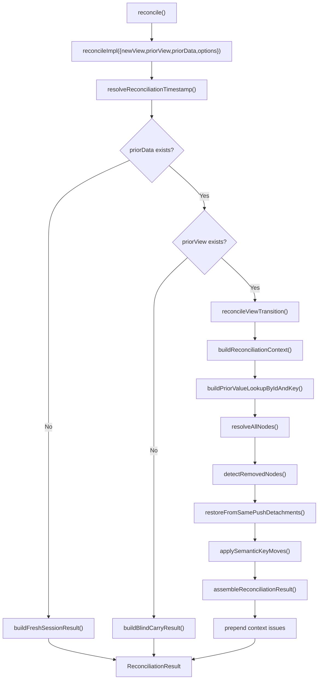

# Reconcile Engine

This folder contains the runtime reconciliation orchestrator and post-resolution transforms used by `@continuum-dev/runtime`.

## Public Boundary

- Supported runtime entrypoint: `reconcile` exported from `packages/runtime/src/lib/reconcile/index.ts`
- Package export surface: `packages/runtime/src/index.ts`
- Internal modules under `reconcile`, `reconciliation`, and `context` are implementation details, not stable public API

## Function Contract

Preferred call form:

- `reconcile({ newView, priorView, priorData, options })`

Legacy call form (deprecated, still supported):

- `reconcile(newView, priorView, priorData, options)`

`reconcile(...)` returns:

- `reconciledState`: next canonical `DataSnapshot`
- `diffs`: change events (`added`, `removed`, `migrated`, `type-changed`, `restored`)
- `resolutions`: per-node resolution provenance and outcome
- `issues`: warnings/errors/info discovered while reconciling

## Entrypoint Branching

The orchestrator resolves timestamp first, then takes exactly one branch:

1. `priorData === null` -> fresh session bootstrap
2. `priorData !== null && priorView === null` -> blind carry branch
3. `priorData !== null && priorView !== null` -> full transition pipeline

## Full Transition Pipeline

The full transition path runs in this order:

1. Build deterministic indexes and traversal issues via `buildReconciliationContext`
2. Build prior-value lookup remapped to new IDs via `buildPriorValueLookupByIdAndKey`
3. Resolve all new nodes via `resolveAllNodes` / `resolveNode`
4. Detect removals and generate detached values via `detectRemovedNodes`
5. Convert same-push add/remove pairs into restore outcomes via `restoreFromSamePushDetachments`
6. Apply cross-level semantic-key migrations via `applySemanticKeyMoves`
7. Assemble canonical output via `assembleReconciliationResult`
8. Prepend context indexing/traversal issues to the final `issues` array

## Match and Carry Precedence

When reconciling a new node against prior view structure, the matching order is:

1. Scoped ID match
2. Unique semantic key match
3. Scoped key match

Semantic-key matching is disabled when either side has non-unique counts for the same semantic key token.

## Determinism and Time

- If `options.clock` is provided, timestamp is `clock()`
- If `options.clock` is not provided and `priorData` exists, timestamp is `priorData.lineage.timestamp + 1`
- If neither condition holds, reconcile throws because fresh sessions require a time source

## Flow Diagram

## Notes for Maintainers

- Keep behavioral statements aligned with specs in:
  - `packages/runtime/src/lib/reconcile/core.spec.ts`
  - `packages/runtime/src/lib/reconcile/stress.spec.ts`
  - `packages/runtime/src/lib/reconcile/semantic-key.spec.ts`
  - `packages/runtime/src/lib/reconcile/hardening.spec.ts`
- If control flow changes, update this document and the diagram in the same change.
