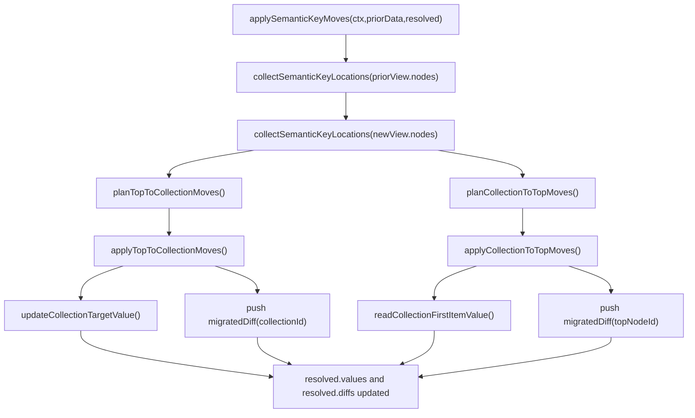

# Semantic Key Moves

This module applies cross-level value migration after normal node resolution. It handles moves between top-level nodes and nodes inside collection templates when semantic identity is preserved.

## When This Runs

`applySemanticKeyMoves` runs in the full transition path after:

1. Per-node resolution
2. Removed-node detection
3. Same-push detach/restore rewrite

It does not run for fresh session or blind-carry branches.

## Location Model

Semantic-key locations are collected from both prior and new view trees:

- `level: "top"` for nodes outside collection templates
- `level: "collection"` for nodes inside collection templates
- For collection locations:
  - `outerCollectionId`: indexed ID of the topmost containing collection
  - `pathChain`: nested template path chain used for read/write traversal

## Planning Rules

Two planners produce migration intents:

- `planTopToCollectionMoves(priorLocations,newLocations)`
  - source: prior top-level semantic location
  - target: new collection semantic location
- `planCollectionToTopMoves(priorLocations,newLocations)`
  - source: prior collection semantic location
  - target: new top-level semantic location

An intent is planned only when all required gates pass:

- Source no longer has a unique same-type counterpart on the original level
- Target exists as a unique same-type semantic match on the destination level
- Collection intents also require valid `outerCollectionId` and non-empty `pathChain`

## Apply Behavior

### Top to Collection

`applyTopToCollectionMoves`:

1. Reads source value from `priorData.values[source.nodeId]`
2. Updates each item in the target collection using `updateCollectionTargetValue`
3. Writes updated collection value to `resolved.values[outerCollectionId]`
4. Removes the source top-level value from `resolved.values`
5. Emits one `migrated` diff per migrated collection node

### Collection to Top

`applyCollectionToTopMoves`:

1. Reads source value from the first item along `pathChain` using `readCollectionFirstItemValue`
2. Clones extracted value into `resolved.values[target.nodeId]`
3. Emits one `migrated` diff per migrated top-level target node

Collection-to-top extraction intentionally uses the first item as deterministic selection behavior.

## Collection Lens Responsibilities

- `updateCollectionTargetValue`: writes cloned source value across target path chain for all items
- `readCollectionFirstItemValue`: reads first-item path-chain value from prior collection data
- `writePathChain` / `readPathFromFirstItem`: recursive nested collection traversal
- `normalizeCollectionState`: normalizes malformed collection shapes to safe defaults

## Diagram

## Test Alignment

Primary behavior coverage:

- `packages/runtime/src/lib/reconcile/semantic-key.spec.ts`
- `packages/runtime/src/lib/reconcile/semantic-moves/semantic-key-move-planner.spec.ts`
- `packages/runtime/src/lib/reconcile/collection-lens/collection-path-lens.spec.ts`
