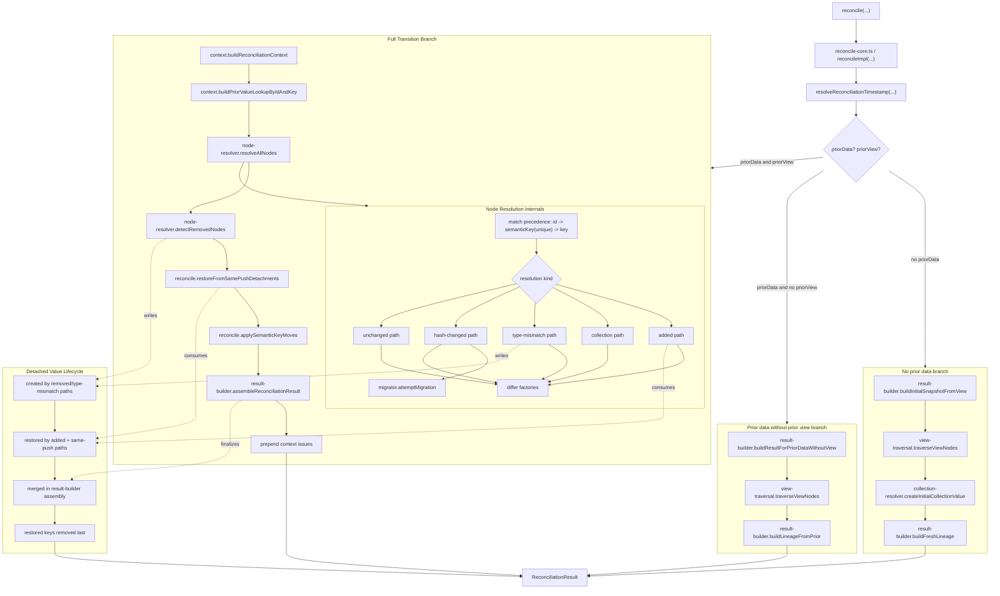

# Reconciliation Internals

Website: [continuumstack.dev](https://continuumstack.dev)  
GitHub: [brytoncooper/continuum-dev](https://github.com/brytoncooper/continuum-dev)

`reconciliation` is the internal engine layer used by the public `reconcile(...)` API.
It owns deterministic node resolution, migration attempts, collection handling, detached value lifecycle, and final result assembly.

## Table of Contents

- [What This Folder Is](#what-this-folder-is)
- [Public Boundary vs Internal Boundary](#public-boundary-vs-internal-boundary)
- [Where Reconciliation Fits](#where-reconciliation-fits)
- [Architecture Diagram](#architecture-diagram)
- [Branching Model](#branching-model)
- [Transition Pipeline](#transition-pipeline)
- [Core Runtime Contracts](#core-runtime-contracts)
- [Determinism Contract](#determinism-contract)
- [Submodule Map](#submodule-map)
- [How Detached Values Flow](#how-detached-values-flow)
- [When to Change Which Module](#when-to-change-which-module)
- [Documentation and Test Anchors](#documentation-and-test-anchors)

## What This Folder Is

This directory contains reconciliation primitives consumed by:

- [`reconcile/reconcile-core.ts`](../reconcile/reconcile-core.ts)
- [`reconcile/transition.ts`](../reconcile/transition.ts)

This folder is not a stable package API. It is an implementation layer behind `@continuum-dev/runtime`.

## Public Boundary vs Internal Boundary

Stable runtime entrypoint:

- [`reconcile/index.ts`](../reconcile/index.ts) (`reconcile(...)`)

Stable package export surface:

- [`packages/runtime/src/index.ts`](../../index.ts)

Internal boundaries in this folder are intentional:

- import each module from its `index.ts` barrel when one exists
- avoid deep imports across module internals
- keep high-arity calls object-shaped to avoid positional coupling bugs

## Where Reconciliation Fits

`reconcileImpl(...)` in `reconcile-core.ts` selects one branch after resolving time:

1. fresh session (`priorData === null`)
2. blind carry (`priorData !== null && priorView === null`)
3. full transition (`priorData !== null && priorView !== null`)

The first two branches delegate directly to `result-builder`.
The full transition branch runs the stage pipeline in `reconcile/transition.ts`.

## Architecture Diagram



## Branching Model

### No prior data

- builder: `result-builder/buildInitialSnapshotFromView`
- used when there is no prior snapshot
- traverses the new view, initializes defaults, emits `added` outcomes, and starts fresh lineage

### Prior data without prior view

- builder: `result-builder/buildResultForPriorDataWithoutView`
- used when snapshot exists but prior view is unavailable
- always emits `NO_PRIOR_VIEW`
- id-aligned copy is gated by `allowPriorDataWithoutPriorView`

### Full Transition

- orchestrator: `reconcile/reconcileViewTransition`
- performs context indexing, node resolution, removal detection, restore/move transforms, then final assembly

## Transition Pipeline

Execution order is fixed:

```text
reconcile/transition.ts
  1) context.buildReconciliationContext(newView, priorView)
  2) context.buildPriorValueLookupByIdAndKey(priorData, context)
  3) node-resolver.resolveAllNodes(context, priorValues, priorData, now, options)
  4) node-resolver.detectRemovedNodes(context, priorData, options, now)
  5) reconcile.restoreFromSamePushDetachments(resolved, removals, context)
  6) reconcile.applySemanticKeyMoves(context, priorData, resolved)
  7) result-builder.assembleReconciliationResult(...)
  8) prepend context issues to final issues array
```

This order is contractually important because later stages depend on artifacts from earlier stages (especially detached values, restored keys, and ordering).

## Core Runtime Contracts

Node resolution dispatch uses structured envelopes:

- match envelope: `newId`, `newNode`, `priorNode`, `priorNodeId`, `matchedBy`, `priorValue`
- runtime envelope: `acc`, `ctx`, `priorData`, `now`, `options`

Primary output contract remains:

- `ReconciliationResult`
  - `reconciledState`
  - `diffs`
  - `resolutions`
  - `issues`

Factory-level record contracts live in `differ` and are consumed by resolver/transform stages:

- `StateDiff`
- `ReconciliationResolution`

## Determinism Contract

For identical structural inputs and the same resolved timestamp, reconciliation outcomes are deterministic:

- match precedence is fixed (`id -> semanticKey(unique) -> key`)
- resolver branch precedence is fixed (added, collection, type-mismatch, hash-changed, unchanged)
- traversal and map iteration order are stable
- detached lookup precedence is fixed
- final concatenation order in result assembly is fixed

Time resolution is deterministic under the current reconcile contract:

- from `options.clock()` when provided
- otherwise from prior lineage (`priorData.lineage.timestamp + 1`) when prior data exists

## Submodule Map

| Module                | What it owns                                                   | Primary doc                                                        |
| --------------------- | -------------------------------------------------------------- | ------------------------------------------------------------------ |
| `view-traversal`      | deterministic DFS traversal, node pathing, depth/cycle issues  | [`view-traversal/README.md`](./view-traversal/README.md)           |
| `differ`              | canonical `StateDiff` and `ReconciliationResolution` factories | [`differ/README.md`](./differ/README.md)                           |
| `migrator`            | migration strategy selection and deterministic chain execution | [`migrator/README.md`](./migrator/README.md)                       |
| `collection-resolver` | collection-value normalization, remap/migrate, constraints     | [`collection-resolver/README.md`](./collection-resolver/README.md) |
| `node-resolver`       | per-node resolution and removed-node detection                 | [`node-resolver/README.md`](./node-resolver/README.md)             |
| `result-builder`      | fresh/blind builders, final assembly, lineage + detached merge | [`result-builder/README.md`](./result-builder/README.md)           |
| `lineage-utils.ts`    | shared value-lineage carry helper used by builders/resolvers   | in-file contracts                                                  |

## How Detached Values Flow

Detached values are created and consumed across multiple stages:

1. created on removal and type mismatch paths
2. potentially restored during added-node resolution and same-push restore
3. merged during final assembly from prior + resolved + removals
4. restored keys are removed last so restored state wins

This lifecycle is central to preserving user data through structural changes while avoiding stale detached residue.

## When to Change Which Module

- change `view-traversal` for traversal ordering, path semantics, or traversal issue detection
- change `node-resolver` for node-level matching/resolution behavior
- change `collection-resolver` for collection-item defaults/migration/constraints behavior
- change `migrator` for migration route selection and strategy execution behavior
- change `differ` only when output record shape/reason semantics need adjustment
- change `result-builder` for branch assembly rules, lineage updates, and detached merge policy

Keep module README behavior statements synchronized with tests whenever behavior changes.

## Documentation and Test Anchors

Primary orchestration docs:

- [`reconcile/README.md`](../reconcile/README.md)
- [`reconcile/semantic-moves/README.md`](../reconcile/semantic-moves/README.md)
- [`reconcile/behavior-guarantees.md`](../reconcile/behavior-guarantees.md)

Primary test anchors:

- [`reconcile/core.spec.ts`](../reconcile/core.spec.ts)
- [`reconcile/stress.spec.ts`](../reconcile/stress.spec.ts)
- [`reconcile/semantic-key.spec.ts`](../reconcile/semantic-key.spec.ts)
- [`reconcile/hardening.spec.ts`](../reconcile/hardening.spec.ts)
- [`reconciliation/node-resolver/node-resolver.spec.ts`](./node-resolver/node-resolver.spec.ts)
- [`reconciliation/collection-resolver/collection-resolver.spec.ts`](./collection-resolver/collection-resolver.spec.ts)
- [`reconciliation/result-builder/result-builder.spec.ts`](./result-builder/result-builder.spec.ts)
