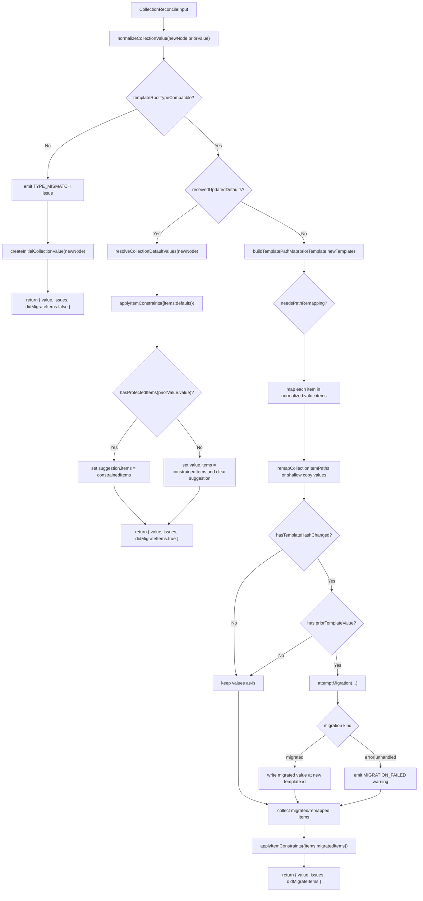
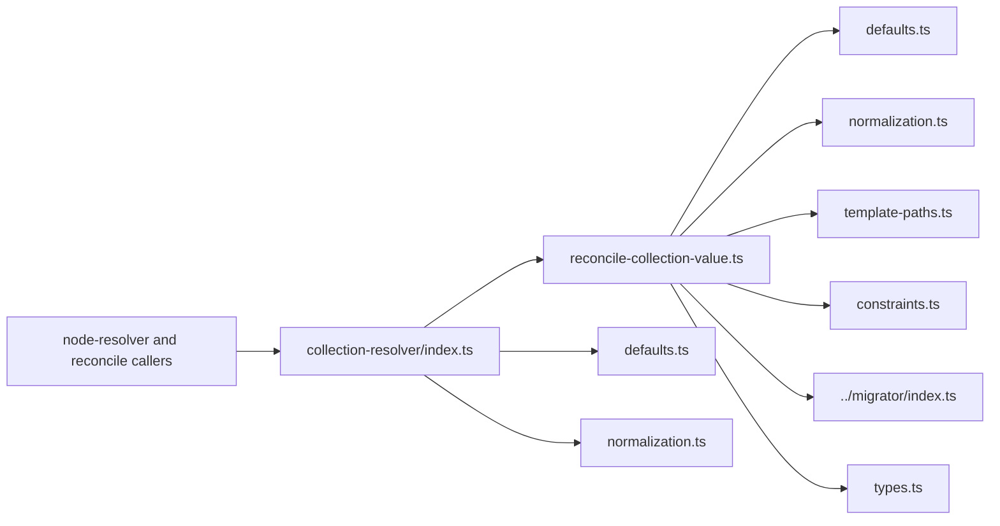
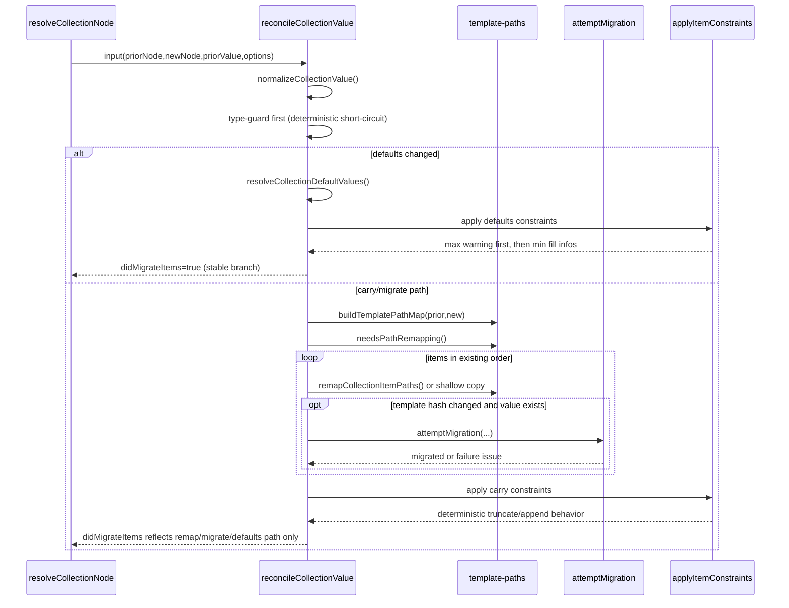

# Collection Resolver

This module reconciles `collection` node values across view transitions while preserving deterministic outcomes.

It is responsible for:

- initializing collection state for fresh nodes/sessions,
- normalizing malformed prior values into canonical collection shape,
- reconciling template-path and template-hash changes,
- applying `minItems` and `maxItems` constraints,
- emitting reconciliation issues without throwing.

## Import Boundary

Use `index.ts` as the only import surface for this module.

- Allowed: `../collection-resolver/index.js`
- Disallowed: deep imports into files under `collection-resolver/*`

ESLint rules enforce this boundary so internals can be refactored safely without changing callers.

## Public API

Exported from `index.ts`:

- `reconcileCollectionValue(input: CollectionReconcileInput): CollectionResolutionResult`
- `createInitialCollectionValue(node: CollectionNode): NodeValue<CollectionNodeState>`
- `normalizeCollectionValue(node: CollectionNode, value: unknown): NodeValue<CollectionNodeState>`
- `resolveCollectionDefaultValues(node: CollectionNode): NodeValue<CollectionNodeState>`

Key types:

- `CollectionReconcileInput`
- `CollectionResolutionResult`
- `ApplyItemConstraintsInput`
- `ResolveUpdatedDefaultsInput`

## Internal Architecture

### 1) Boundary layer

- `index.ts` is a documented alias surface.
- It re-exports stable API and forwards reconciliation to implementation.

### 2) Orchestration layer

- `reconcile-collection-value.ts` contains transition logic in deterministic phase order:
  1. normalize prior value,
  2. guard on incompatible template root type,
  3. branch for updated `defaultValues`,
  4. remap/migrate item values,
  5. apply constraints and finalize result.

### 3) Focused helpers

- `defaults.ts`: initial/default value construction and template default extraction.
- `normalization.ts`: canonicalization and compatibility/protection checks.
- `template-paths.ts`: template key/path maps and path remapping.
- `constraints.ts`: `minItems`/`maxItems` enforcement + issue emission.
- `types.ts`: typed contracts for orchestration inputs/outputs.

## Reconciliation Flow Diagram

## Module Interaction Diagram

## Determinism Checkpoints

## Determinism Guarantees

Behavior in this module is intentionally order-stable and side-effect constrained:

- Item order is preserved through reconciliation (`map` order).
- Overflow truncation is deterministic (`slice(0, max)`).
- Underflow fill is deterministic (append until `minItems`).
- Issue emission order is deterministic:
  - max constraint warning first (when applicable),
  - then one min-fill info issue per inserted item.
- Type-mismatch guard short-circuits before defaults/migration work.
- Path remap migration detection uses identity semantics (`values !== item.values`).
- Default update detection is currently `JSON.stringify` comparison and is intentionally unchanged.
- Protected prior items (`isDirty`/`isSticky`) retain value and route new defaults to `suggestion`.

## Reconciliation Result Contract

`CollectionResolutionResult` returns:

- `value`: next canonical collection node value.
- `issues`: warnings/info/errors discovered during processing.
- `didMigrateItems`: whether item-level migration/remap/default-update semantics changed carried state.

`didMigrateItems` is consumed by node-resolution/diff logic to choose migrated vs carried outcomes.

## Failure Model

- Migration failures do not throw.
- Failures are reported via `issues` with `MIGRATION_FAILED`.
- Reconciliation continues and returns usable state.

## Constraints and Defaults Semantics

- `defaultValues` is applied only when it is an array.
- Keys in `defaultValues` are resolved through template key-to-path mapping when possible.
- Missing paths are backfilled from template defaults.
- `minItems` and `maxItems` are normalized with floor semantics:
  - negative/undefined `minItems` -> `0`,
  - negative/undefined `maxItems` -> `undefined`.

## Testing Anchors

Primary coverage:

- `collection-resolver.spec.ts` for module behavior and edge cases.
- `core.spec.ts`, `stress.spec.ts`, and `semantic-key.spec.ts` for end-to-end determinism and transition guarantees.

When changing this module, preserve existing expectations for:

- issue ordering and severity,
- item ordering and constraint behavior,
- metadata carry (`suggestion`, `isDirty`, `isSticky`, `isValid`),
- migrated vs carried classification.
