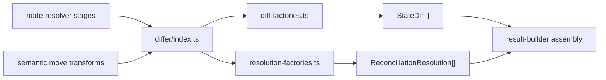

# Differ Module

The `differ` module is the canonical factory layer for reconciliation output records:

- `StateDiff` entries (`added`, `removed`, `type-changed`, `migrated`, `restored`)
- `ReconciliationResolution` entries (`added`, `carried`, `detached`, `migrated`, `restored`)

This module does not perform matching, migration, or traversal. It only creates standardized record shapes used by resolver stages.

## Why This Exists

- Single import boundary for all diff/resolution record creation
- Consistent record shape and reason strings across reconciliation paths
- Typed-object inputs for high-arity resolution records to prevent positional argument mistakes
- Pure deterministic construction with no side effects

## Import Boundary

Use:

- `../differ/index.js`

Avoid:

- `../differ/diff-factories.js`
- `../differ/resolution-factories.js`
- `../differ/types.js`

Direct deep imports are intentionally blocked by lint rules so this barrel remains the stable contract.

## File Layout

- `index.ts` - documented alias/barrel surface
- `diff-factories.ts` - `StateDiff` factory implementations
- `resolution-factories.ts` - `ReconciliationResolution` factory implementations
- `types.ts` - typed input contracts for high-arity factories
- `differ.spec.ts` - behavior/contract tests

## Determinism Guarantees

- Factory functions are pure
- Output depends only on input arguments
- No timestamp, random, or global-state access
- Call order determines result order; factories never reorder data

## Data Flow



## Usage Example

Prefer object-shaped inputs for high-arity resolution creation:

```ts
import { migratedResolution } from '../differ/index.js';

const resolution = migratedResolution({
  nodeId: 'new-id',
  priorId: 'old-id',
  matchedBy: 'key',
  priorType: 'field',
  newType: 'field',
  priorValue: { value: 'old' },
  reconciledValue: { value: 'new' },
});
```

## Non-Goals

- No schema matching logic
- No migration strategy execution
- No detached value lookup
- No result aggregation or ordering policy
