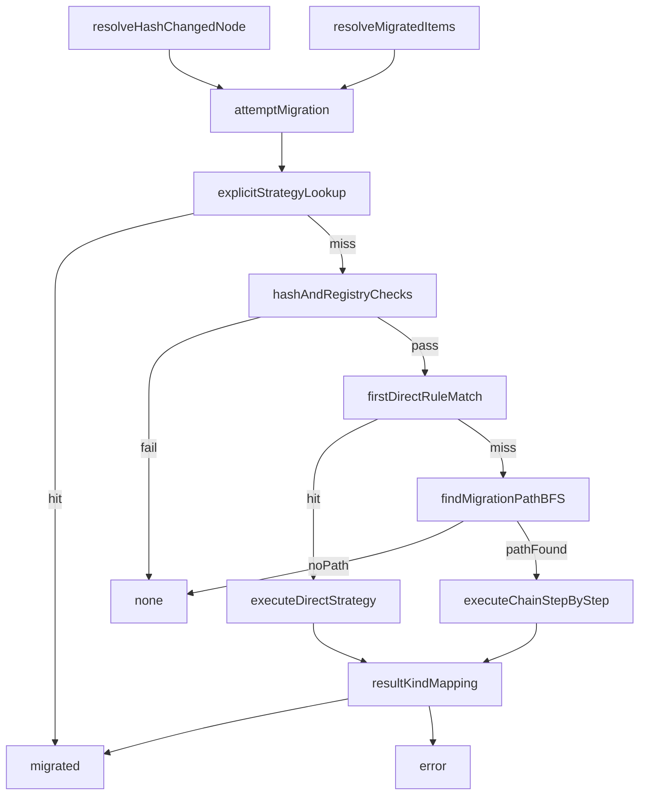

# Migrator Architecture

The migrator resolves node-value transitions when a node hash changes across
view versions, while preserving reconciliation outcomes and strict
deterministic behavior.

Public entrypoint:
- `reconciliation/migrator/index.ts`

Internal implementation:
- `reconciliation/migrator/migrator-core.ts`

## Import Boundary

- Application code and reconciliation modules should import from
  `../migrator/index.js`.
- Internal implementation files under `migrator/` are private and intentionally
  not part of the public API.
- ESLint deep-import restrictions enforce this boundary.

## API Surface

- `attemptMigration(...)`
  - preferred: object input `MigrationAttemptInput`
  - supported legacy: positional parameters
- `MigrationAttemptResult`
  - `{ kind: 'migrated'; value: unknown }`
  - `{ kind: 'none' }`
  - `{ kind: 'error'; error: unknown }`

## Deterministic Resolution Model

Precedence order is fixed:

1. explicit per-node strategy from `options.migrationStrategies[nodeId]`
2. first matching direct rule in `newNode.migrations`
3. deterministic BFS chain through declared migration rules
4. `none`

The same inputs produce the same route selection and output shape.

## Data Flow

## Chain Determinism Guarantees

- BFS traversal preserves insertion order of migration rules.
- Equal-length path ties resolve by declaration order in `newNode.migrations`.
- Cycle handling is stable via `seen` tracking.
- Max path length is hard-limited to `10`.
- Each step receives:
  - `priorValue` from previous step output
  - `priorNode.hash` set to current route hash
  - `newNode.hash` set to step target hash

## Typed Object Contracts

- `MigrationAttemptInput`
  - `nodeId`
  - `priorNode`
  - `newNode`
  - `priorValue`
  - `options`
- `MigrationStrategyContext`
  - context-style strategy invocation contract
- `MigrationStrategy`
  - context-style callback signature only

## Failure Semantics

- Missing rules or registry strategy: `{ kind: 'none' }`
- No reachable chain path: `{ kind: 'none' }`
- Strategy throw: `{ kind: 'error', error }`
- Successful execution: `{ kind: 'migrated', value }`

This contract is relied on by node and collection reconciliation callers to
emit deterministic warning behavior and fallback resolution.
