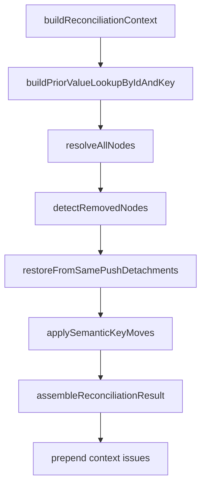
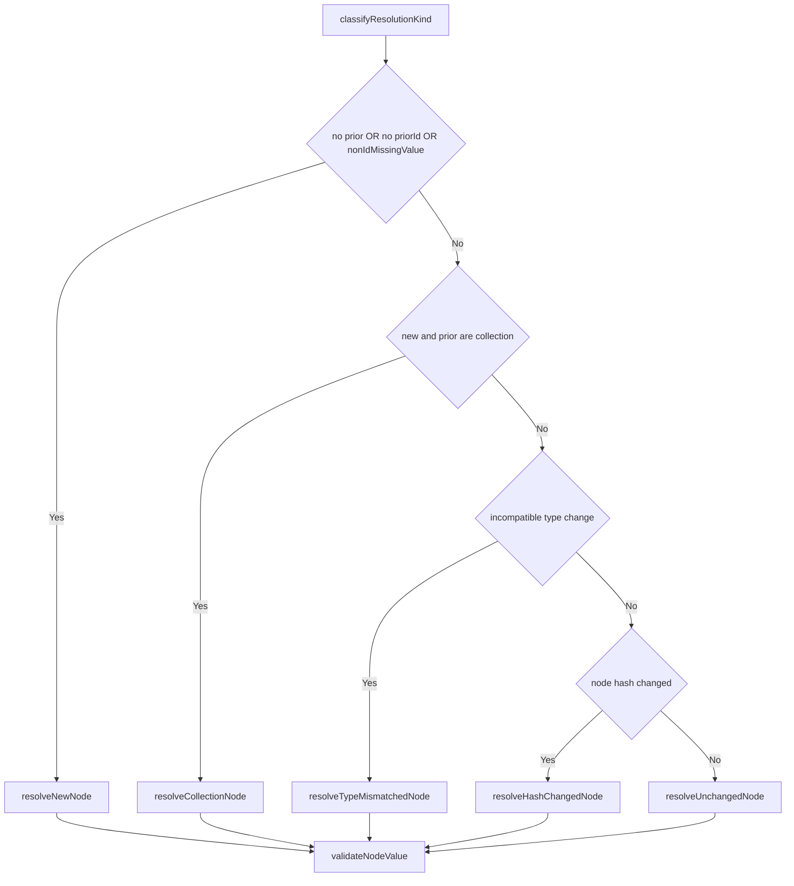
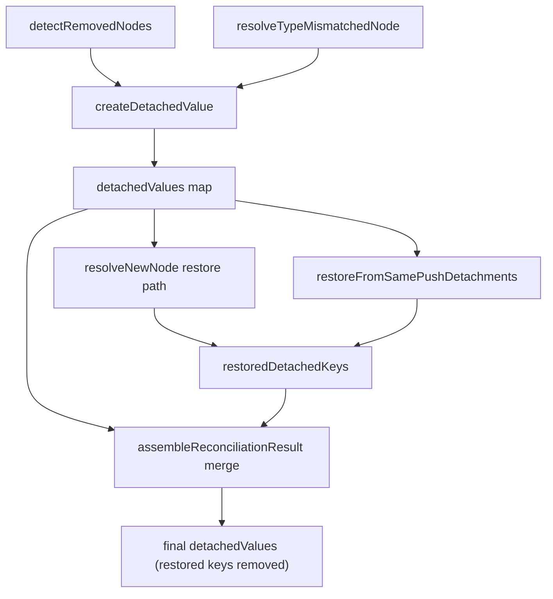

# Node Resolver Internals

`node-resolver` is the reconciliation stage that resolves node-level outcomes for a view transition.

It is responsible for:

- resolving every node in the new view into carried/added/migrated/detached/restored outcomes
- detecting removed prior nodes and creating detached-value records
- producing deterministic `diffs`, `resolutions`, `issues`, `values`, and `valueLineage` inputs for final assembly

This module is an internal implementation detail of runtime reconciliation.

## Import Boundary

Import from:

- `packages/runtime/src/lib/reconciliation/node-resolver/index.ts`

Do not deep-import internal files under this folder from outside `node-resolver`.

Gateway API:

- `resolveAllNodes(...)`
- `detectRemovedNodes(...)`
- `findDetachedValueForNode(...)`

## Where It Fits

`node-resolver` is used by the full transition pipeline in `reconcile/transition.ts`.

## Core Data Model

### Context Inputs

- `ReconciliationContext` from `context/index.ts`
  - indexed maps by id/key/semanticKey for new and prior views
  - deterministic match helpers (`findPriorNode`, `findNewNodeByPriorNode`, `determineNodeMatchStrategy`)
- `priorValues: Map<string, unknown>`
  - prior values remapped by matching logic
- `priorData: DataSnapshot`
  - canonical prior state, detached values, lineage

### Node Resolver Working Set

- `NodeResolutionAccumulator`
  - `values`
  - `valueLineage`
  - `detachedValues`
  - `restoredDetachedKeys`
  - `diffs`
  - `resolutions`
  - `issues`

### Typed Object Contracts

`node-resolver/types.ts` defines typed object inputs used to reduce positional coupling:

- `NodeMatchEnvelope`
- `NodeResolutionRuntime`
- `ResolveNodeInput`
- per-branch inputs (`ResolveNewNodeInput`, `ResolveCollectionNodeInput`, `ResolveHashChangedNodeInput`, `ResolveTypeMismatchedNodeInput`, `ResolveUnchangedNodeInput`)

## Match and Value Source Precedence

For each new node:

1. prior node match order: `id -> semanticKey (unique) -> key`
2. match strategy is recorded as `matchedBy`
3. prior value selection:
   - for `id` matches: use remapped lookup, then fallback to `priorData.values[priorNodeId]`
   - for non-`id` matches: use remapped lookup only
4. non-`id` match with `priorValue === undefined` is treated as added

These rules are implemented in `index.ts` and `matched-node.ts`.

## Per-Node Resolution Decision Tree

Branch precedence is strict and deterministic:

1. `added`
2. `collection`
3. `typeMismatch`
4. `hashChanged`
5. `unchanged`

## Branch Semantics

### Added (`resolve-added-node.ts`)

- attempts detached restore first (`semanticKey -> key -> nodeId`)
- restore requires compatible type (`previousNodeType === newNode.type`)
- when restored:
  - writes value
  - records restored diff/resolution
  - tracks restored detached key
- otherwise initializes new value:
  - collection: `createInitialCollectionValue`
  - non-collection: `defaultValue` when present
  - emits added diff/resolution

### Collection (`resolve-collection-node.ts`)

- delegates to `collection-resolver/reconcileCollectionValue`
- always writes resolved collection value
- carries value lineage
- appends collection issues
- emits:
  - `migrated` diff/resolution when items migrated
  - otherwise `carried` resolution

### Type Mismatch (`resolve-type-mismatch-node.ts`)

- emits `TYPE_MISMATCH` error issue
- emits `type-changed` diff
- emits detached resolution
- if prior value exists, stores detached value with reason `type-mismatch`

### Hash Changed (`resolve-hash-changed-node.ts`)

- attempts migration through `migrator/attemptMigration`
- on migrated result:
  - writes migrated value
  - updates lineage with migrated flag
  - emits migrated diff/resolution
- on no strategy or migration error:
  - emits `MIGRATION_FAILED` warning
  - falls back to unchanged resolver

### Unchanged (`resolve-unchanged-node.ts`)

- carries prior value when present
- may apply default-value update when identity gate passes:
  - same id, or same semanticKey, or same key
- dirty/sticky values get suggestion updates instead of overwrites
- clean values may be overwritten by new default
- emits carried resolution and optional migrated diff for default-update cases

## Removed Node Detection

`detectRemovedNodes(...)` walks `priorData.values` and marks entries as removed when neither condition holds:

- the resolved prior id still exists in new index
- a forward match exists from prior node to some new node

For removed nodes:

- emits removed diff
- stores detached value (when prior value exists)
- emits `NODE_REMOVED` warning unless `allowPartialRestore` is true

## Detached Value Lifecycle

Detached values are created by removal and type mismatch paths, and restored by added/same-push restore paths.

## Determinism Contract

For identical inputs (including clock/timestamps), this stage is deterministic because:

- matching precedence is fixed
- branch precedence is fixed
- detached lookup precedence is fixed
- iteration sources are deterministic (`ctx.newById`, `Object.entries(priorData.values)`)
- migration failure handling is fixed (`MIGRATION_FAILED` + unchanged fallback)

## What Is Contract vs Implementation Detail

### Safe To Rely On

- deterministic outcomes for identical inputs
- node matching precedence and carry behavior
- type mismatch protection and detached behavior
- hash-change migration attempt with unchanged fallback on failure
- removed-node detached retention and restore compatibility checks

### Internal Detail (Do Not Depend On)

- exact ordering of all diff/issue entries across categories
- exact issue message text
- internal helper names, file structure, and adapter layering
- incidental ordering effects not explicitly documented as guarantees

## Test Anchors

Behavior is primarily locked by:

- `node-resolver/node-resolver.spec.ts`
- `reconcile/core.spec.ts`
- `reconcile/stress.spec.ts`
- `reconcile/semantic-key.spec.ts`
- `reconcile/hardening.spec.ts`
- `reconciliation/collection-resolver/collection-resolver.spec.ts`

When changing node-resolver behavior, update tests first and keep this README aligned with observed behavior.
