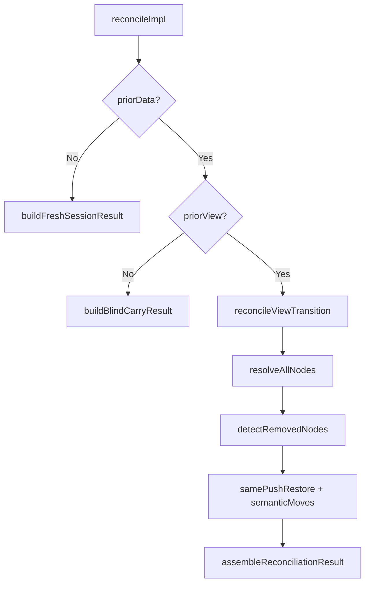
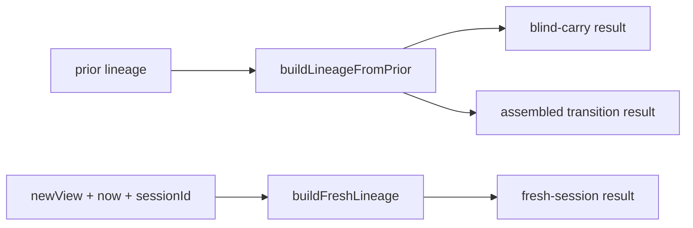
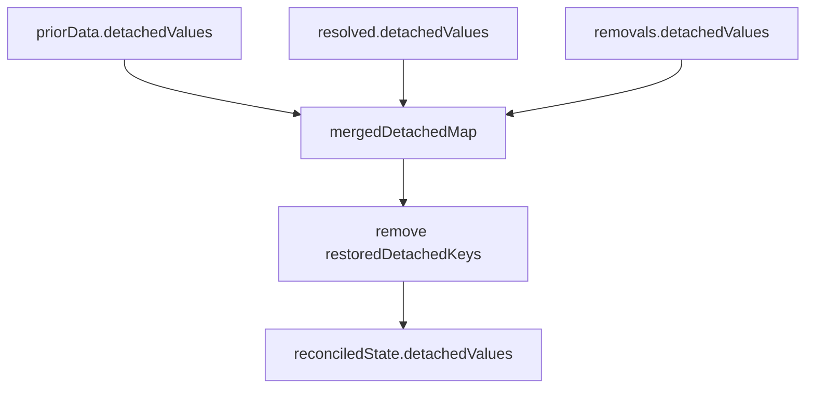

# Result Builder Module

`result-builder` is the final composition layer for reconciliation outputs.

It is responsible for:

- building branch-specific results for fresh-session and blind-carry paths
- assembling transition-stage resolver/removal outputs into a single final result
- normalizing lineage updates across those paths
- applying detached-value merge and restored-key cleanup rules

This module does not perform node matching, migration strategy execution, or detached-value lookup heuristics. Those concerns live in `context`, `node-resolver`, and `migrator`.

## Import Boundary

Import from:

- `packages/runtime/src/lib/reconciliation/result-builder/index.ts`

Avoid deep imports into files under this folder from outside `result-builder`.

Public entrypoints:

- `buildFreshSessionResult`
- `buildBlindCarryResult`
- `assembleReconciliationResult`
- `computeViewHash`
- `generateSessionId`
- `carryValuesMeta` (compatibility export)

## Why This Module Exists

- keeps final output shape logic centralized
- enforces deterministic merge and ordering policies
- provides typed object contracts for high-arity operations
- isolates lineage/detached handling from resolver branch code

## Where It Fits In Reconciliation

## Core Contracts

Typed object inputs live in `types.ts`:

- `AssembleReconciliationResultInput`
- `BlindCarryResultInput`
- `FreshSessionResultInput`
- `FreshNodeCollectionInput`
- `LineageBaseInput`
- `LineageWithHashInput`
- `FreshLineageInput`
- `RemovedNodesResult`

These contracts prevent positional argument coupling and make callsites self-documenting.

## Branch Responsibilities

### Fresh Session (`fresh-session.ts`)

Used when there is no `priorData`.

Behavior:

- traverses all nodes in the new view
- initializes values from explicit defaults only
- initializes collection values via `createInitialCollectionValue`
- emits `added` diffs/resolutions for each visited node
- emits `NO_PRIOR_DATA`
- creates fresh lineage with a generated `sessionId`

### Blind Carry (`blind-carry.ts`)

Used when `priorData` exists but `priorView` is missing.

Behavior:

- always emits `NO_PRIOR_VIEW`
- always includes duplicate issues from current view traversal
- when `allowBlindCarry=false`:
  - values are dropped
  - detached values are preserved
  - lineage is updated to new view metadata
- when `allowBlindCarry=true`:
  - carries only exact scoped id matches
  - carries corresponding `valueLineage` entries for carried ids only
  - emits `UNVALIDATED_CARRY` per carried id
  - preserves detached values

Non-goal in this path:

- no key/semantic-key based blind carry

### Transition Assembly (`assemble-result.ts`)

Used after resolver + removal stages complete.

Behavior:

- merges detached values with precedence:
  1. `priorData.detachedValues`
  2. `resolved.detachedValues`
  3. `removals.detachedValues`
- applies restored-key deletion after the merge
- updates lineage from prior lineage:
  - sets `timestamp`, `viewId`, `viewVersion`
  - includes `viewHash` only when defined
- concatenates in deterministic order:
  - `diffs = [...resolved.diffs, ...removals.diffs]`
  - `issues = [...resolved.issues, ...removals.issues]`

## Lineage Model

Lineage helpers live in `reconciled-lineage.ts`:

- `buildLineageFromPrior` for blind-carry and transition assembly
- `buildFreshLineage` for fresh-session creation

Value-level lineage carry helper:

- `carryValuesMeta` (implemented in `reconciliation/lineage-utils.ts`, re-exported here for compatibility)

## Detached Value Merge Semantics

Important rule:

- restored keys are removed after all detached sources are merged, so restoration wins in the final snapshot.

## Determinism Guarantees

For identical inputs, `result-builder` is deterministic:

- no random generation besides deterministic timestamp-seeded session id creation
- no global mutable state reads
- explicit fixed order for diff/issue concatenation
- stable view-signature generation in `computeViewHash`

## File Layout

- `index.ts` - stable public boundary with documented exports and type contracts
- `types.ts` - typed input/result contracts
- `fresh-session.ts` - no-prior-data branch builder
- `blind-carry.ts` - no-prior-view branch builder
- `assemble-result.ts` - transition output assembler
- `reconciled-lineage.ts` - lineage construction helpers
- `view-hash.ts` - deterministic view signature + session id helpers
- `lineage.ts` - compatibility re-export of value-lineage carry helper
- `result-builder.spec.ts` - contract and regression tests

## Test Anchors

Primary behavior locks:

- `reconciliation/result-builder/result-builder.spec.ts`
- `reconcile/core.spec.ts`
- `reconcile/hardening.spec.ts`

When changing behavior here, update tests first and keep this README aligned with observed contracts.
