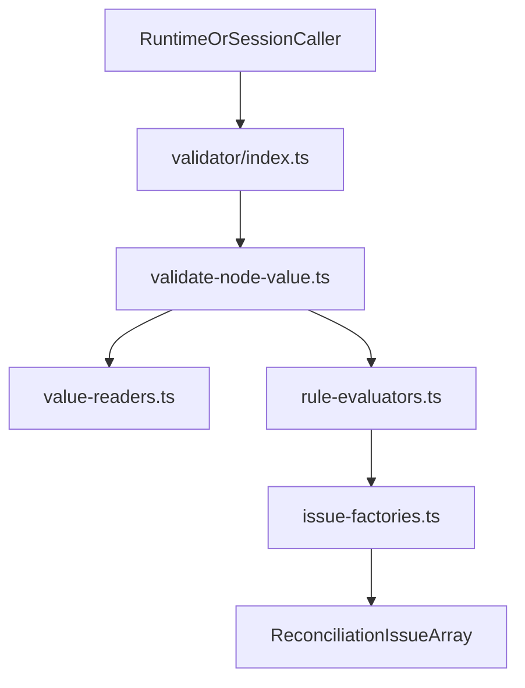

# Validator Module

The `validator` module validates field node values against contract constraints and emits runtime reconciliation issues.

## Why This Exists

- Single import boundary for validation semantics used by runtime and session paths
- Consistent issue shape and wording for validation failures
- Typed object inputs for internal evaluators to reduce positional-argument mistakes
- Deterministic, side-effect free validation flow

## Import Boundary

Use:

- `../validator/index.js`

Avoid:

- `../validator/validate-node-value.js`
- `../validator/rule-evaluators.js`
- `../validator/value-readers.js`
- `../validator/issue-factories.js`
- `../validator/types.js`

## Public API

- `validateNodeValue(node, state): ReconciliationIssue[]`

## File Layout

- `index.ts` - stable public boundary
- `validate-node-value.ts` - orchestrates validation flow
- `value-readers.ts` - state value extraction and empty-value checks
- `rule-evaluators.ts` - required, numeric, string, and pattern evaluation
- `issue-factories.ts` - standard validation issue construction
- `types.ts` - typed object input contracts
- `validator.spec.ts` - behavior and determinism tests

## Determinism Guarantees

- Validation is pure and depends only on `(node, state)` input
- Required failure short-circuits additional checks
- Numeric issues emit in `min`, then `max` order
- String issues emit in `minLength`, then `maxLength`, then `pattern` order

## Data Flow

## Non-Goals

- No schema matching or node traversal logic
- No migration execution
- No result aggregation policy beyond local issue ordering
